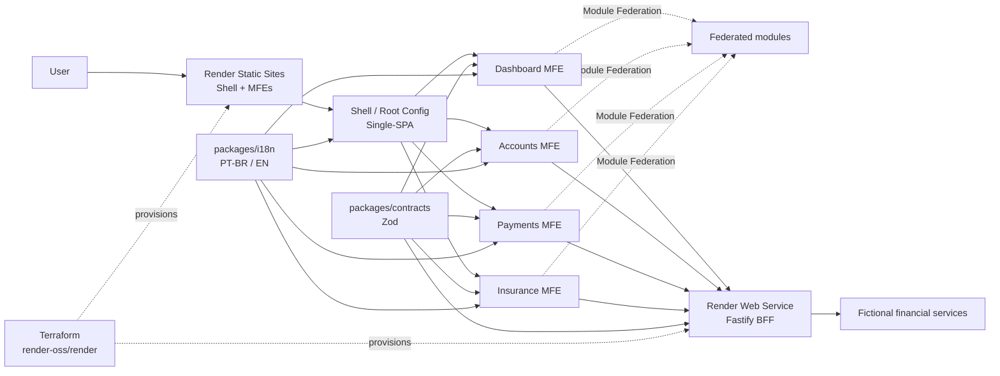
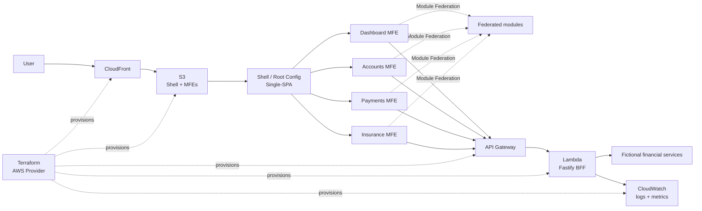

# Financial MFE Hub

[Português](./README.md) | [English](./README.en.md)

Full-stack architecture case for a **fictional financial hub**. The project demonstrates how **Micro Frontends**, shared contracts, business rules, UI, a BFF, internationalization, testing, observability, CI/CD and infrastructure can evolve together inside a monorepo.

> Educational and portfolio project. All financial data, rules and flows are fictional and do not represent a real financial institution.

## Goal

Build a technical case close to high-criticality corporate scenarios, with explicit responsibilities, independent deployment per application and architectural decisions documented before implementation.

The project explores:

- React + TypeScript across multiple Micro Frontends;
- orchestration with Single-SPA;
- runtime composition with Webpack Module Federation;
- a pnpm + Turborepo monorepo;
- shared Zod contracts across front-end, BFF and tests;
- forms with Formik + Zod;
- Context API for local flow/domain state;
- a Fastify + Node.js BFF;
- internationalization with PT-BR as the default locale and English as an alternative;
- unit, integration, contract and E2E tests;
- Core Web Vitals, accessibility and observability;
- CI/CD with GitHub Actions;
- the primary Render infrastructure declared with Terraform.

## Architecture



<details>
<summary><strong>What would this architecture look like on AWS?</strong></summary>

The primary architecture remains **Terraform + Render**. The diagram below is only an architectural comparison and does not represent the infrastructure used by the main case.



| Main case | AWS alternative |
| --- | --- |
| Render Static Sites | S3 + CloudFront |
| Render Web Service | Lambda + API Gateway |
| Render logs and metrics | CloudWatch |
| Terraform `render-oss/render` | Terraform AWS Provider |

This optional path may later be implemented to compare **PaaS vs cloud primitives**, operational cost, deployment and portability.

</details>

## Main responsibilities

**Single-SPA** controls application lifecycle and decides which MFEs are mounted according to route and context.

**Module Federation** exposes and consumes public modules at runtime while keeping explicit contracts between hosts and remotes.

**Turborepo** coordinates monorepo dependencies, cache and tasks. It does not replace the Micro Frontend architecture.

**Fastify BFF** centralizes data adaptation, authoritative validation, authentication, authorization, response composition and downstream service isolation.

**Zod** defines runtime contracts reused across front-end, BFF and tests. The client validates early for UX; the server validates again and remains authoritative.

**Formik** controls form state and lifecycle. Zod remains the canonical source for portable validation rules, while Context API is used inside clearly owned boundaries.

**Terraform** describes the infrastructure actually used on Render and allows infrastructure changes to be reviewed with `plan` before applying them.

## Planned stack

### Front-end

- React
- TypeScript
- Tailwind CSS
- Single-SPA
- Webpack 5
- Module Federation
- React Router
- TanStack Query
- Context API
- Zustand only for truly global client-side state within a clear owner
- Formik
- Zod
- i18next + react-i18next

### BFF

- Node.js
- Fastify
- TypeScript
- Zod
- Swagger / OpenAPI
- structured logging

### Monorepo and quality

- pnpm workspaces
- Turborepo
- ESLint
- Prettier
- Jest
- React Testing Library
- MSW
- Faker
- Playwright
- Storybook

### Infrastructure and delivery

- Render Static Sites
- Render Web Service
- Terraform with the `render-oss/render` provider
- GitHub Actions

AWS remains an optional architectural comparison path and is not required for the main case to work.

## Target structure

```text
apps/
├── shell/
├── dashboard-mfe/
├── accounts-mfe/
├── payments-mfe/
├── insurance-mfe/
└── bff/

packages/
├── context/
├── contracts/
├── ui/
├── auth/
├── i18n/
├── eslint-config/
└── typescript-config/

infrastructure/
└── terraform/
    ├── modules/
    │   ├── static-site/
    │   ├── web-service/
    │   └── shared/
    └── environments/
        └── production/
```

## Shared validation

The same Zod contracts are reused at relevant boundaries. Formik uses an adapter that maps `ZodError` into Formik errors, while the BFF validates every untrusted request again.

Server-dependent rules such as available balance, account existence and authorization remain on the BFF/domain side.

## State and Context API

Context API is used inside a flow or domain with clear ownership, for example inside `payments-mfe`.

It must not become a global context exposing Accounts, Payments and Insurance internals. Cross-MFE communication should prefer URL state, BFF/server state, public events or explicit federated contracts.

## Internationalization

The product uses **PT-BR as the default locale** and **English (`en`) as an alternative**.

The Shell coordinates the active locale while each MFE owns its translation namespaces. Locale changes must use a public contract and must not depend on another MFE's internal store.

## Deployment strategy

Render is the official runtime environment for the case.

```text
GitHub Actions
      │
      ├── shell ───────────────┐
      ├── dashboard-mfe ───────┤
      ├── accounts-mfe ────────┤──> Render Static Sites
      ├── payments-mfe ────────┤
      └── insurance-mfe ───────┘

      └── bff ───────────────────> Render Web Service
```

Each application has an independent service, artifact and evolution path. The Shell resolves remote URLs through environment/runtime configuration.

## Terraform

Render infrastructure is represented under `infrastructure/terraform` using the `render-oss/render` provider.

The expected flow includes:

```text
terraform fmt -check
terraform validate
terraform plan
terraform apply
```

`plan` is part of review. `apply` must be protected and secrets are never committed.

## Documentation

Canonical technical documentation lives in [`packages/context`](./packages/context/README.md):

- [`SDD.md`](./packages/context/SDD.md): architecture, boundaries, decisions, security, performance, i18n, CI/CD and infrastructure;
- [`PROJECT-TASKS.md`](./packages/context/PROJECT-TASKS.md): incremental implementation flow and completion criteria;
- `adr/`: architectural decisions that need their own history.

## Status

🟢 **SDD 1.0 and the documentation foundation are consolidated.**

The next implementation step is `FMH-002 — Initialize the pnpm workspace`.