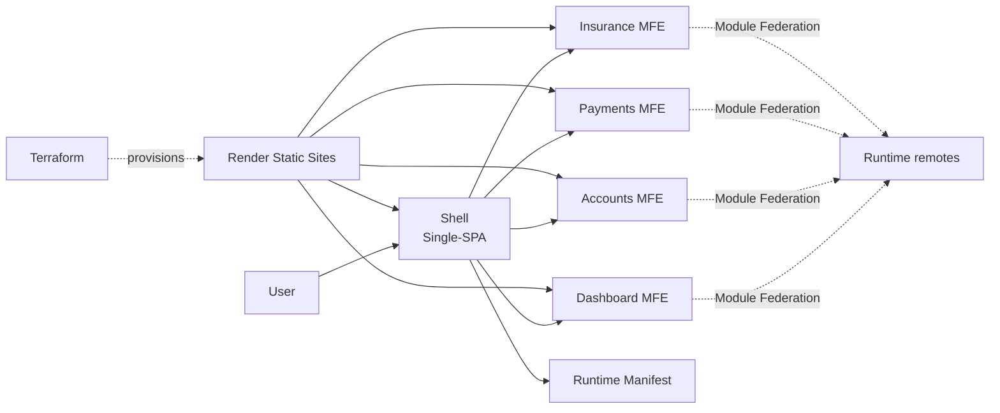

# Financial MFE Hub

[Português](./README.md) | [English](./README.en.md)

Architecture POC for a **fictional financial hub**, built to demonstrate a small and observable **Micro Frontend architecture with React, TypeScript, Single-SPA and Webpack Module Federation**.

> Educational and portfolio project. All financial data, rules and flows are fictional and do not represent a real financial institution.

## Published demo

The public POC is hosted on Render. The best entry point for understanding the case is the **Shell**, which composes the Micro Frontends and preserves the architecture view.

| Environment | Link | Role |
| --- | --- | --- |
| **Shell / Main demo** | [financial-mfe-hub-production-shell.onrender.com](https://financial-mfe-hub-production-shell.onrender.com) | Single-SPA composition |
| **Architecture Health** | [open architecture console](https://financial-mfe-hub-production-shell.onrender.com/architecture-health) | Shell-level POC diagnostics |
| Dashboard MFE | [open environment](https://financial-mfe-hub-production-dashboard.onrender.com) | independent remote |
| Accounts MFE | [open environment](https://financial-mfe-hub-production-accounts.onrender.com) | independent remote |
| Payments MFE | [open environment](https://financial-mfe-hub-production-payments.onrender.com) | independent remote |
| Insurance MFE | [open environment](https://financial-mfe-hub-production-insurance.onrender.com) | independent remote |

> Direct MFE links are remote diagnostic endpoints. The composed experience should be viewed through the Shell.

## What this POC demonstrates

- one Shell controlling navigation and lifecycle with **Single-SPA**;
- four independent Micro Frontends;
- runtime module loading through **Webpack Module Federation**;
- `React` and `React DOM` shared as singletons;
- a runtime manifest used to resolve remotes without domain coupling;
- remote fallback without taking down the entire SPA;
- independent builds with **pnpm + Turborepo**;
- CI through GitHub Actions;
- environments declared with **Terraform + Render**;
- a distinct visual identity per MFE so mount/unmount and ownership are easy to demonstrate;
- a technical `/architecture-health` route preserved so the architecture remains explainable even if the case evolves later.

## Architecture



### Responsibilities

**Single-SPA** decides which application should mount or unmount according to the current route.

**Module Federation** resolves and loads the public contract exposed by each remote at runtime.

**Turborepo** coordinates monorepo tasks and dependencies; it is not the Micro Frontend composition mechanism.

**Terraform** describes the Render infrastructure and makes infrastructure changes reviewable before applying them.

## POC identity

| Application | Color | Route |
| --- | --- | --- |
| `dashboard-mfe` | blue | `/dashboard` |
| `accounts-mfe` | green | `/accounts` |
| `payments-mfe` | purple | `/payments` |
| `insurance-mfe` | orange | `/insurance` |

The colors are intentionally simple: the goal is to make **ownership, mount/unmount, isolation and fallback** immediately visible rather than to build a final design system.

## Stack used by the POC

### Front-end

- React
- TypeScript
- Single-SPA
- Webpack 5
- Module Federation

### Monorepo and quality

- pnpm workspaces
- Turborepo
- ESLint
- Prettier
- GitHub Actions

### Infrastructure

- Render Static Sites
- Terraform
- `render-oss/render` provider

### BFF / recorded evolution

The repository also contains the foundation for a **Fastify BFF**, health checking, typed configuration, Web Service infrastructure, an HTTP smoke-test strategy and a Swagger/OpenAPI backlog. Those items remain documented for future evolution, but they are not required to understand the public architecture POC being closed as a demonstrator.

## Main structure

```text
apps/
├── shell/
├── dashboard-mfe/
├── accounts-mfe/
├── payments-mfe/
├── insurance-mfe/
└── bff/

packages/
├── context/
├── eslint-config/
└── typescript-config/

infrastructure/
└── terraform/
    ├── modules/
    └── environments/
        └── production/
```

## Run locally

Requirements:

- Node.js 22+
- pnpm 10+

```bash
pnpm install
pnpm dev
```

Local environments:

```text
Shell       http://localhost:4200
Dashboard   http://localhost:4201
Accounts    http://localhost:4202
Payments    http://localhost:4203
Insurance   http://localhost:4204
BFF         http://localhost:4300
```

Open the Shell and navigate across domains. The technical console is available at:

```text
http://localhost:4200/architecture-health
```

## Quality gates

```bash
pnpm format:check
pnpm lint
pnpm typecheck
pnpm test
pnpm build
```

For Render infrastructure:

```bash
pnpm render:validate
pnpm render:plan
```

The repository also contains reproducible HTTP smoke tests:

```bash
pnpm smoke
pnpm smoke:production
```

## POC closure decision

This version is considered **sufficient as an architecture demonstrator**. The goal is not to simulate a complete internet-banking product, but to make decisions that are normally difficult to visualize easy to explain:

```text
Shell
  ↓
Single-SPA
  ↓
runtime manifest
  ↓
Module Federation
  ↓
4 independent remotes
  ↓
fallback + CI + Terraform + Render
```

Product features, financial contracts, authentication, a design system, i18n, Swagger/OpenAPI, advanced observability and the remaining backlog are intentionally left as future evolution and are not required to close this POC.

## Technical documentation

Detailed technical documentation remains under [`packages/context`](./packages/context/README.md):

- [`SDD.md`](./packages/context/SDD.md) — architecture and boundaries;
- [`PROJECT-TASKS.md`](./packages/context/PROJECT-TASKS.md) — backlog and acceptance criteria;
- [`CI-CD.md`](./packages/context/CI-CD.md) — CI, deployment, smoke tests and rollback;
- [`ADR-001`](./packages/context/adr/ADR-001-architecture-validation-first.md) — Architecture Validation First;
- [`ADR-004`](./packages/context/adr/ADR-004-runtime-manifest-and-controlled-rollback.md) — runtime manifest and controlled rollback;
- [`ADR-005`](./packages/context/adr/ADR-005-architecture-health-console.md) — preserving the Architecture Health Console;
- [`ADR-006`](./packages/context/adr/ADR-006-controlled-render-cd.md) — controlled Render CD strategy.

## Status

🟢 **Architecture POC closed as a demonstrator.**

The repository remains open for incremental evolution, while the main proof — independent Micro Frontends composed into one SPA through runtime federation and reproducible infrastructure — is preserved.