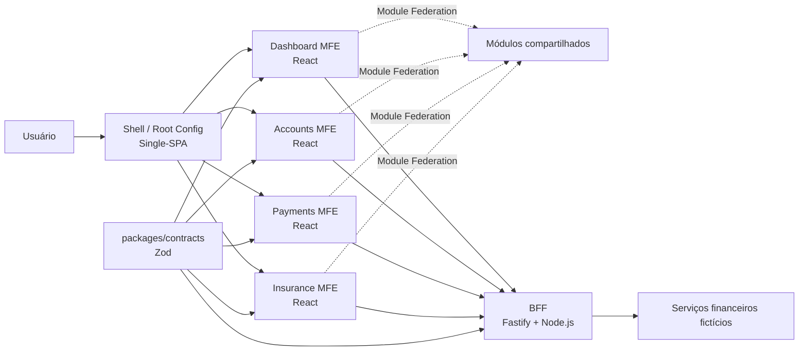
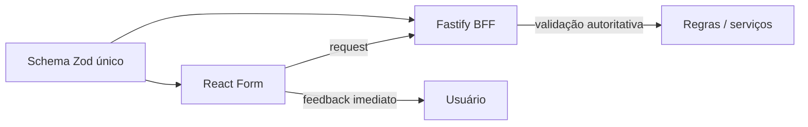

# Financial MFE Hub

POC de arquitetura front-end distribuída para um domínio financeiro fictício, com foco em **Micro Frontends**, **Single-SPA**, **Webpack Module Federation**, contratos compartilhados com **Zod** e uma camada **BFF em Fastify**.

> Projeto educacional e de portfólio. Os dados, regras e fluxos financeiros são fictícios.

## Objetivo

O projeto existe para explorar, de forma prática, uma arquitetura próxima de cenários corporativos de alta criticidade, mantendo responsabilidades bem definidas entre aplicações, módulos e contratos.

Os principais objetivos são:

- orquestrar múltiplos Micro Frontends em uma única experiência;
- permitir evolução e deploy independentes dos MFEs;
- compartilhar módulos em runtime com Module Federation;
- centralizar contratos de entrada e saída com Zod;
- reutilizar schemas Zod na validação de formulários e na API;
- concentrar regras sensíveis e composição de dados no BFF;
- aplicar testes automatizados, observabilidade e gates de CI/CD;
- documentar decisões e evolução pelo fluxo SDD + tasks.

## Arquitetura proposta



### Responsabilidades principais

**Single-SPA** decide quais aplicações devem ser carregadas e montadas conforme rota e contexto.

**Module Federation** permite que aplicações exponham e consumam módulos em runtime, sem transformar toda integração em dependência publicada por pacote.

**Turborepo** organiza o workspace, dependências, tarefas e cache. Ele não substitui a arquitetura de Micro Frontends.

**Fastify BFF** concentra composição de dados, autorização, regras dependentes de serviços e adaptação das APIs para as necessidades do front-end.

**Zod** define contratos reutilizáveis entre front-end, BFF e testes. O front valida cedo por experiência de usuário; o BFF valida novamente e continua sendo a autoridade.

## Stack planejada

### Front-end

- React
- TypeScript
- Tailwind CSS
- Single-SPA
- Webpack 5
- Module Federation
- React Router
- TanStack Query
- Zustand, apenas para estado global necessário
- Zod

### BFF

- Node.js
- Fastify
- TypeScript
- Zod

### Monorepo e qualidade

- pnpm workspaces
- Turborepo
- ESLint
- Prettier
- Jest
- React Testing Library
- MSW
- Playwright
- Storybook
- GitHub Actions

## Estrutura alvo

```text
apps/
├── shell/                 root config e orquestração Single-SPA
├── dashboard-mfe/         visão consolidada
├── accounts-mfe/          contas, cartões e limites
├── payments-mfe/          PIX, boleto e transferências fictícias
├── insurance-mfe/         seguros e simulações fictícias
└── bff/                   Fastify BFF

packages/
├── context/               SDD, decisões e fluxo de tasks
├── contracts/             schemas Zod e tipos inferidos
├── ui/                    componentes e tokens compartilhados
├── auth/                  primitivas e contratos de autenticação
├── eslint-config/
└── typescript-config/
```

## Validação compartilhada



Exemplo de separação de responsabilidades:

- `valor > 0`: contrato Zod compartilhado;
- formato de documento ou e-mail: contrato Zod compartilhado;
- usuário possui saldo suficiente: regra do BFF/domínio;
- usuário tem autorização para executar a operação: regra do BFF.

## Documentação

A documentação técnica e o histórico de evolução ficam em [`packages/context`](./packages/context/README.md):

- [`SDD.md`](./packages/context/SDD.md): arquitetura, fronteiras e decisões técnicas;
- [`PROJECT-TASKS.md`](./packages/context/PROJECT-TASKS.md): fluxo incremental de implementação e critérios de conclusão.

## Status

🟡 **Fase de definição arquitetural.**

A primeira etapa é consolidar o SDD e o fluxo de tarefas antes de iniciar a implementação.

## Idiomas

Este README em **PT-BR é a documentação padrão** do projeto. Uma versão em inglês será adicionada em `README.en.md` quando a base arquitetural estiver estabilizada.
