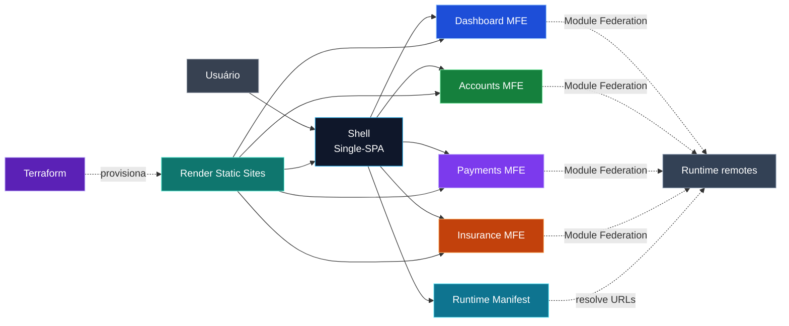
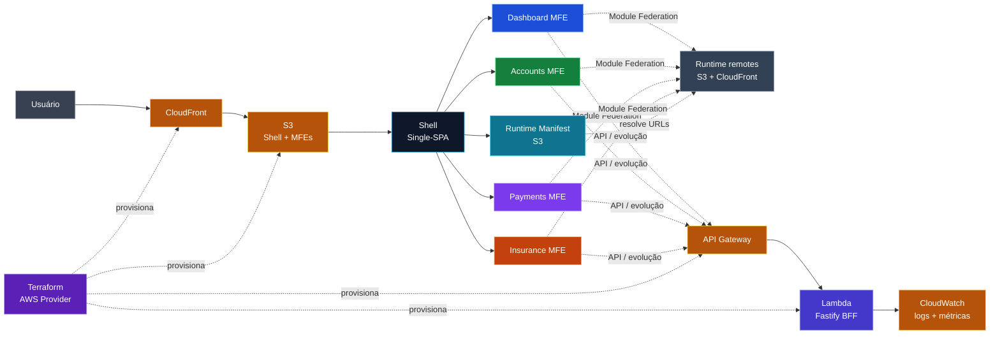

# Financial MFE Hub

[Português](./README.md) | [English](./README.en.md)

POC arquitetural de um **hub financeiro fictício** construída para demonstrar, de forma pequena e observável, uma arquitetura de **Micro Frontends com React, TypeScript, Single-SPA e Webpack Module Federation**.

> Projeto educacional e de portfólio. Os dados, regras e fluxos financeiros são fictícios e não representam uma instituição financeira real.

## Demo publicada

A POC pública está hospedada no Render. A melhor entrada para entender o case é o **Shell**, que compõe os Micro Frontends e preserva a visão arquitetural.

| Ambiente | Link | Papel |
| --- | --- | --- |
| **Shell / Demo principal** | [financial-mfe-hub-production-shell.onrender.com](https://financial-mfe-hub-production-shell.onrender.com) | composição Single-SPA |
| **Architecture Health** | [abrir console arquitetural](https://financial-mfe-hub-production-shell.onrender.com/architecture-health) | diagnóstico da POC pelo Shell |
| Dashboard MFE | [abrir ambiente](https://financial-mfe-hub-production-dashboard.onrender.com) | remote independente |
| Accounts MFE | [abrir ambiente](https://financial-mfe-hub-production-accounts.onrender.com) | remote independente |
| Payments MFE | [abrir ambiente](https://financial-mfe-hub-production-payments.onrender.com) | remote independente |
| Insurance MFE | [abrir ambiente](https://financial-mfe-hub-production-insurance.onrender.com) | remote independente |

> Os links diretos dos MFEs são endpoints de diagnóstico dos remotes. A experiência composta deve ser observada pelo Shell.

## O que esta POC demonstra

- um único Shell controlando a navegação e o lifecycle com **Single-SPA**;
- quatro Micro Frontends independentes;
- módulos carregados em runtime por **Webpack Module Federation**;
- `React` e `React DOM` compartilhados como singletons;
- runtime manifest para resolver os remotes sem acoplamento de domínio;
- fallback de remote sem derrubar a SPA inteira;
- builds independentes via **pnpm + Turborepo**;
- CI com GitHub Actions;
- infraestrutura dos ambientes declarada com **Terraform + Render**;
- identidade visual distinta por MFE para tornar mount/unmount e ownership fáceis de demonstrar;
- uma rota técnica `/architecture-health` preservada para explicar e diagnosticar a arquitetura mesmo que o case evolua no futuro.

## Arquitetura

As mesmas cores usadas nos stubs da POC aparecem no diagrama para deixar ownership e fronteiras visíveis de imediato.



<details>
<summary><strong>Como seria essa arquitetura na AWS?</strong></summary>

A infraestrutura realmente utilizada pela POC continua sendo **Terraform + Render**. A visão abaixo é apenas uma comparação arquitetural útil para discutir portabilidade e trade-offs em uma entrevista; ela **não representa um ambiente AWS publicado por este repositório**.



| POC no Render | Equivalente conceitual na AWS |
| --- | --- |
| Render Static Sites | S3 + CloudFront |
| Runtime manifest em arquivo estático | S3 + CloudFront |
| Render Web Service para uma futura evolução do BFF | Lambda + API Gateway |
| Logs e métricas do Render | CloudWatch |
| Terraform `render-oss/render` | Terraform AWS Provider |

A comparação deixa explícito que **Single-SPA, Module Federation e o contrato dos remotes não dependem do Render**; a camada de infraestrutura pode mudar sem redesenhar a composição dos Micro Frontends.

</details>

### Responsabilidades

**Single-SPA** decide qual aplicação deve montar ou desmontar conforme a rota.

**Module Federation** resolve e carrega o contrato público dos remotes em runtime.

**Turborepo** coordena tarefas e dependências do monorepo; ele não é o mecanismo de composição dos Micro Frontends.

**Terraform** descreve a infraestrutura Render e permite revisar mudanças antes de aplicá-las.

## Identidade da POC

| Aplicação | Cor | Rota |
| --- | --- | --- |
| `dashboard-mfe` | azul | `/dashboard` |
| `accounts-mfe` | verde | `/accounts` |
| `payments-mfe` | roxo | `/payments` |
| `insurance-mfe` | laranja | `/insurance` |

As cores são deliberadamente simples: o objetivo desta etapa é tornar **ownership, mount/unmount, isolamento e fallback** imediatamente visíveis, não construir um design system final.

## Stack utilizada na POC

### Front-end

- React
- TypeScript
- Single-SPA
- Webpack 5
- Module Federation

### Monorepo e qualidade

- pnpm workspaces
- Turborepo
- ESLint
- Prettier
- GitHub Actions

### Infraestrutura

- Render Static Sites
- Terraform
- provider `render-oss/render`

### BFF / evolução registrada

O repositório também contém a fundação de um **Fastify BFF**, health check, configuração tipada, infraestrutura de Web Service, estratégia de smoke test e backlog para Swagger/OpenAPI. Essa evolução permanece documentada, mas não é necessária para entender a POC pública que está sendo encerrada como demonstrativo arquitetural.

## Estrutura principal

```text
apps/
├── shell/
├── dashboard-mfe/
├── accounts-mfe/
├── payments-mfe/
├── insurance-mfe/
└── bff/

packages/
├── context/
├── eslint-config/
└── typescript-config/

infrastructure/
└── terraform/
    ├── modules/
    └── environments/
        └── production/
```

## Executar localmente

Requisitos:

- Node.js 22+
- pnpm 10+

```bash
pnpm install
pnpm dev
```

Ambientes locais:

```text
Shell       http://localhost:4200
Dashboard   http://localhost:4201
Accounts    http://localhost:4202
Payments    http://localhost:4203
Insurance   http://localhost:4204
BFF         http://localhost:4300
```

Abra o Shell e navegue entre os domínios. A console técnica fica em:

```text
http://localhost:4200/architecture-health
```

## Quality gates

```bash
pnpm format:check
pnpm lint
pnpm typecheck
pnpm test
pnpm build
```

Para a infraestrutura Render:

```bash
pnpm render:validate
pnpm render:plan
```

O repositório também possui smoke HTTP reproduzível:

```bash
pnpm smoke
pnpm smoke:production
```

## Decisão de encerramento da POC

Esta versão é considerada **suficiente como demonstrativo arquitetural**. O objetivo não é simular um internet banking completo, e sim tornar decisões normalmente difíceis de visualizar fáceis de explicar:

```text
Shell
  ↓
Single-SPA
  ↓
runtime manifest
  ↓
Module Federation
  ↓
4 remotes independentes
  ↓
fallback + CI + Terraform + Render
```

Funcionalidades de produto, contratos financeiros, autenticação, design system, i18n, Swagger/OpenAPI, observabilidade avançada e demais itens continuam registrados no backlog para evolução futura, sem serem requisito para o fechamento desta POC.

## Documentação técnica

A documentação detalhada permanece em [`packages/context`](./packages/context/README.md):

- [`SDD.md`](./packages/context/SDD.md) — visão arquitetural e fronteiras;
- [`PROJECT-TASKS.md`](./packages/context/PROJECT-TASKS.md) — backlog e critérios de aceite;
- [`CI-CD.md`](./packages/context/CI-CD.md) — CI, deploy, smoke e rollback;
- [`ADR-001`](./packages/context/adr/ADR-001-architecture-validation-first.md) — Architecture Validation First;
- [`ADR-004`](./packages/context/adr/ADR-004-runtime-manifest-and-controlled-rollback.md) — manifest e rollback controlado;
- [`ADR-005`](./packages/context/adr/ADR-005-architecture-health-console.md) — preservação da Architecture Health Console;
- [`ADR-006`](./packages/context/adr/ADR-006-controlled-render-cd.md) — estratégia de CD controlado no Render.

## Status

🟢 **POC arquitetural encerrada como demonstrativo.**

O repositório permanece aberto para evolução incremental, mas a prova principal — composição de Micro Frontends independentes em uma SPA, com runtime federation e infraestrutura reproduzível — está preservada.
