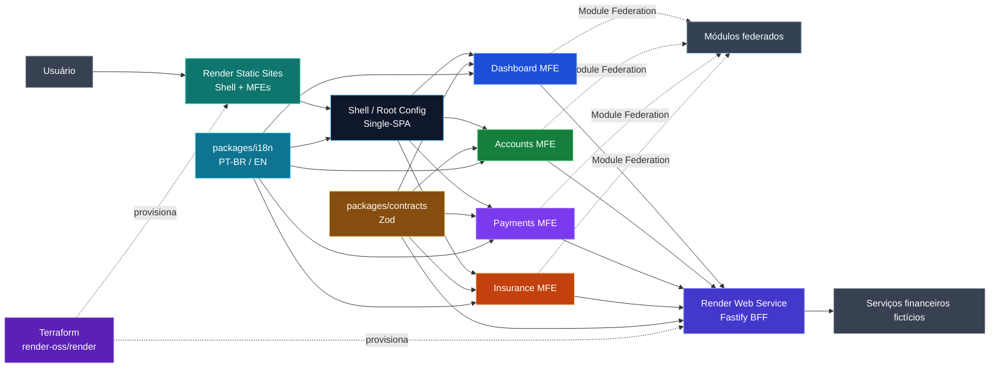
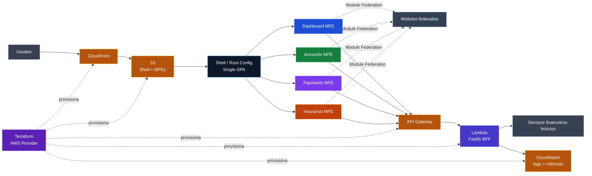
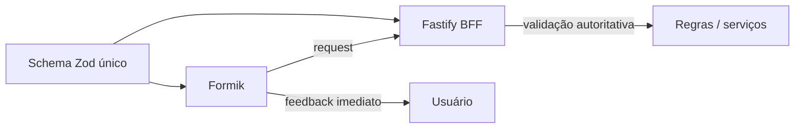

# Financial MFE Hub

[Português](./README.md) | [English](./README.en.md)

Case full-stack de arquitetura para um **hub financeiro fictício**. O projeto demonstra como **Micro Frontends**, contratos compartilhados, regras de negócio, interface, BFF, internacionalização, testes, observabilidade, CI/CD e infraestrutura podem evoluir juntos dentro de um monorepo.

> Projeto educacional e de portfólio. Os dados, regras e fluxos financeiros são fictícios e não representam uma instituição financeira real.

## Objetivo

Construir um case técnico próximo de cenários corporativos de alta criticidade, com responsabilidades explícitas, deploy independente por aplicação e decisões arquiteturais documentadas antes da implementação.

O projeto explora:

- React + TypeScript em múltiplos Micro Frontends;
- orquestração com Single-SPA;
- composição runtime com Webpack Module Federation;
- monorepo com pnpm + Turborepo;
- contratos Zod compartilhados entre front-end, BFF e testes;
- formulários com Formik + Zod;
- Context API para estado de fluxo/domínio local;
- BFF em Fastify + Node.js;
- internacionalização com PT-BR como idioma padrão e inglês como alternativa;
- testes unitários, integração, contrato e E2E;
- Core Web Vitals, acessibilidade e observabilidade;
- CI/CD com GitHub Actions;
- infraestrutura principal no Render declarada com Terraform.

## Arquitetura

As cores dos MFEs no diagrama também são utilizadas durante a fase inicial de validação arquitetural para facilitar a identificação visual de qual aplicação foi montada.



<details>
<summary><strong>Como seria essa arquitetura na AWS?</strong></summary>

A arquitetura principal do projeto continua sendo **Terraform + Render**. A visão abaixo existe apenas como comparação arquitetural e não representa a infraestrutura utilizada pelo case principal.



| Case principal | Alternativa AWS |
| --- | --- |
| Render Static Sites | S3 + CloudFront |
| Render Web Service | Lambda + API Gateway |
| Logs e métricas do Render | CloudWatch |
| Terraform `render-oss/render` | Terraform AWS Provider |

Essa trilha poderá ser implementada futuramente para comparar **PaaS vs cloud primitives**, custo operacional, deploy e portabilidade.

</details>

## Architecture Validation First

Antes de construir uma aplicação financeira grande, o projeto valida a arquitetura com a menor quantidade possível de código de produto.

A primeira milestone utiliza **stubs visuais simples e coloridos**:

| Aplicação | Cor inicial | Objetivo da fase |
| --- | --- | --- |
| `dashboard-mfe` | azul | provar mount/unmount e rota |
| `accounts-mfe` | verde | provar segundo remote independente |
| `payments-mfe` | roxo | provar evolução paralela de domínio |
| `insurance-mfe` | laranja | provar escala da composição |

Cada stub mostra apenas informações úteis para diagnóstico, como nome do MFE, versão/build e ambiente. A identidade visual inicial não define o design system final.

```text
workspace
  ↓
shell + MFEs coloridos
  ↓
BFF /health
  ↓
CI/CD
  ↓
Terraform + Render
  ↓
runtime config
  ↓
smoke test + rollback
  ↓
ARCHITECTURE GATE ✅
  ↓
evolução funcional dos domínios
```

A fase inicial deve provar Single-SPA, Module Federation, builds/deploys independentes, runtime remotes, fallback, CI/CD, Terraform, Render, smoke tests e rollback **antes** de investir em regras de negócio, dashboards ou formulários completos.

A decisão está registrada em [`ADR-001 — Architecture Validation First`](./packages/context/adr/ADR-001-architecture-validation-first.md).

## Responsabilidades principais

**Single-SPA** controla o ciclo de vida e decide quais aplicações são montadas conforme rota e contexto.

**Module Federation** permite expor e consumir módulos públicos em runtime, mantendo contratos explícitos entre host e remotes.

**Turborepo** coordena dependências, cache e tarefas do monorepo. Ele não substitui a arquitetura de Micro Frontends.

**Fastify BFF** centraliza adaptação de dados, validação autoritativa, autenticação, autorização, composição de respostas e isolamento de serviços downstream.

**Zod** define contratos runtime reutilizados entre front-end, BFF e testes. O front valida cedo por UX; o servidor valida novamente e permanece a autoridade.

**Formik** controla estado e lifecycle dos formulários. O projeto mantém Zod como fonte canônica das regras portáveis e utiliza Context API dentro de owners claros.

**Terraform** descreve a infraestrutura realmente utilizada no Render, permitindo revisar mudanças com `plan` antes de qualquer aplicação.

## Stack planejada

### Front-end

- React
- TypeScript
- Tailwind CSS
- Single-SPA
- Webpack 5
- Module Federation
- React Router
- TanStack Query
- Context API
- Zustand somente para estado client-side realmente global
- Formik
- Zod
- i18next + react-i18next

### BFF

- Node.js
- Fastify
- TypeScript
- Zod
- Swagger / OpenAPI
- logging estruturado

### Monorepo e qualidade

- pnpm workspaces
- Turborepo
- ESLint
- Prettier
- Jest
- React Testing Library
- MSW
- Faker
- Playwright
- Storybook

### Infraestrutura e entrega

- Render Static Sites
- Render Web Service
- Terraform com provider `render-oss/render`
- GitHub Actions

AWS permanece como trilha opcional de comparação arquitetural, não como requisito do funcionamento principal.

## Estrutura alvo

```text
apps/
├── shell/                 root config e orquestração Single-SPA
├── dashboard-mfe/         visão consolidada
├── accounts-mfe/          contas, cartões e limites
├── payments-mfe/          PIX, boleto e transferências fictícias
├── insurance-mfe/         seguros e simulações fictícias
└── bff/                   Fastify BFF

packages/
├── context/               SDD, ADRs, decisões e fluxo de tasks
├── contracts/             schemas Zod e tipos inferidos
├── ui/                    componentes e tokens compartilhados
├── auth/                  contratos e primitivas de autenticação
├── i18n/                  configuração e contratos de idioma
├── eslint-config/
└── typescript-config/

infrastructure/
└── terraform/
    ├── modules/
    │   ├── static-site/
    │   ├── web-service/
    │   └── shared/
    └── environments/
        └── production/
```

## Validação compartilhada



Exemplos:

- `valor > 0`: contrato Zod compartilhado;
- formato de documento ou e-mail: contrato Zod compartilhado;
- saldo disponível suficiente: regra de domínio/BFF;
- autorização para executar operação: regra do BFF.

## Estado e Context API

Context API é utilizada dentro de um fluxo ou domínio com ownership claro, por exemplo dentro de `payments-mfe`.

Ela não deve virar um contexto global compartilhando internals de Accounts, Payments e Insurance. Comunicação cross-MFE deve preferir URL, BFF/server state, eventos públicos ou contratos federados explícitos.

## Internacionalização

O produto usa **PT-BR como idioma padrão** e **inglês (`en`) como alternativa**.

A preferência de idioma é coordenada pelo Shell, enquanto cada MFE mantém seus próprios namespaces de tradução. Alterações de idioma devem utilizar um contrato público e não depender de stores internas de outro MFE.

## Estratégia de deploy

O ambiente oficial do case é o Render.

```text
GitHub Actions
      │
      ├── shell ───────────────┐
      ├── dashboard-mfe ───────┤
      ├── accounts-mfe ────────┤──> Render Static Sites
      ├── payments-mfe ────────┤
      └── insurance-mfe ───────┘

      └── bff ───────────────────> Render Web Service
```

Cada aplicação possui serviço, artefato e evolução independentes. O Shell resolve as URLs dos remotes por configuração de ambiente.

## Terraform

A infraestrutura Render será representada em `infrastructure/terraform` usando o provider oficial `render-oss/render`.

O fluxo previsto inclui:

```text
terraform fmt -check
terraform validate
terraform plan
terraform apply
```

`plan` faz parte da revisão. `apply` deve ser protegido e secrets nunca são versionados.

## Case opcional AWS

Após a arquitetura principal estar funcional no Render, uma trilha opcional poderá comparar a mesma solução com primitives AWS, como S3, CloudFront, Lambda, API Gateway e CloudWatch.

Essa trilha não é requisito para considerar o projeto concluído.

## Documentação

A documentação canônica fica em [`packages/context`](./packages/context/README.md):

- [`SDD.md`](./packages/context/SDD.md): arquitetura, fronteiras, decisões, segurança, performance, i18n, CI/CD e infraestrutura;
- [`CI-CD.md`](./packages/context/CI-CD.md): pipeline, quality gates, deploy, smoke tests e rollback;
- [`PROJECT-TASKS.md`](./packages/context/PROJECT-TASKS.md): fluxo incremental e critérios de conclusão;
- [`ADR-001`](./packages/context/adr/ADR-001-architecture-validation-first.md): validação arquitetural antes da evolução funcional.

## Status

🟢 **SDD 1.0 e fundação documental consolidados.**

A próxima etapa é iniciar `FMH-002` e seguir a trilha crítica de **Architecture Validation First** até o Architecture Gate.