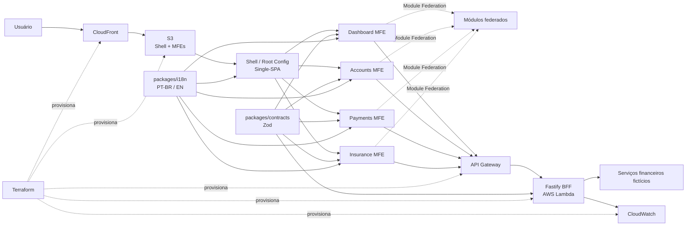
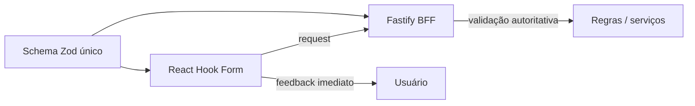

# Financial MFE Hub

[Português](./README.md) | [English](./README.en.md)

Case full-stack de arquitetura para um **hub financeiro fictício**. O projeto demonstra como **Micro Frontends**, contratos compartilhados, regras de negócio, interface, BFF, internacionalização, testes, observabilidade, CI/CD e infraestrutura podem evoluir juntos dentro de um monorepo.

> Projeto educacional e de portfólio. Os dados, regras e fluxos financeiros são fictícios e não representam uma instituição financeira real.

## Objetivo

Construir um case técnico próximo de cenários corporativos de alta criticidade, com responsabilidades explícitas, deploy independente por aplicação e decisões arquiteturais documentadas antes da implementação.

O projeto explora:

- React + TypeScript em múltiplos Micro Frontends;
- orquestração com Single-SPA;
- composição runtime com Webpack Module Federation;
- monorepo com pnpm + Turborepo;
- contratos Zod compartilhados entre front-end, BFF e testes;
- formulários com React Hook Form + Zod;
- BFF em Fastify + Node.js;
- internacionalização com PT-BR como idioma padrão e inglês como alternativa;
- testes unitários, integração, contrato e E2E;
- Core Web Vitals, acessibilidade e observabilidade;
- CI/CD com GitHub Actions;
- infraestrutura AWS declarada com Terraform.

## Arquitetura



## Responsabilidades principais

**Single-SPA** controla o ciclo de vida e decide quais aplicações são montadas conforme rota e contexto.

**Module Federation** permite expor e consumir módulos públicos em runtime, mantendo contratos explícitos entre host e remotes.

**Turborepo** coordena dependências, cache e tarefas do monorepo. Ele não substitui a arquitetura de Micro Frontends.

**Fastify BFF** centraliza adaptação de dados, validação autoritativa, autenticação, autorização, composição de respostas e isolamento de serviços downstream.

**Zod** define contratos runtime reutilizados entre front-end, BFF e testes. O front valida cedo por UX; o servidor valida novamente e permanece a autoridade.

**Terraform** descreve a infraestrutura AWS como código e permite revisar mudanças com `plan` antes de qualquer aplicação.

## Stack planejada

### Front-end

- React
- TypeScript
- Tailwind CSS
- Single-SPA
- Webpack 5
- Module Federation
- React Router
- TanStack Query
- Zustand somente para estado client-side realmente global
- React Hook Form
- Zod
- i18next + react-i18next

### BFF

- Node.js
- Fastify
- TypeScript
- Zod
- Swagger / OpenAPI
- logging estruturado

### Monorepo e qualidade

- pnpm workspaces
- Turborepo
- ESLint
- Prettier
- Jest
- React Testing Library
- MSW
- Faker
- Playwright
- Storybook

### Infraestrutura e entrega

- AWS S3
- AWS CloudFront
- AWS Lambda
- Amazon API Gateway
- Amazon CloudWatch
- AWS Budgets
- Terraform
- GitHub Actions

## Estrutura alvo

```text
apps/
├── shell/                 root config e orquestração Single-SPA
├── dashboard-mfe/         visão consolidada
├── accounts-mfe/          contas, cartões e limites
├── payments-mfe/          PIX, boleto e transferências fictícias
├── insurance-mfe/         seguros e simulações fictícias
└── bff/                   Fastify BFF

packages/
├── context/               SDD, ADRs, decisões e fluxo de tasks
├── contracts/             schemas Zod e tipos inferidos
├── ui/                    componentes e tokens compartilhados
├── auth/                  contratos e primitivas de autenticação
├── i18n/                  configuração e contratos de idioma
├── eslint-config/
└── typescript-config/

infrastructure/
└── terraform/
    ├── modules/
    │   ├── frontend/
    │   ├── bff/
    │   ├── observability/
    │   └── budget/
    └── environments/
        └── production/
```

## Validação compartilhada



Exemplos:

- `valor > 0`: contrato Zod compartilhado;
- formato de documento ou e-mail: contrato Zod compartilhado;
- saldo disponível suficiente: regra de domínio/BFF;
- autorização para executar operação: regra do BFF.

## Internacionalização

O produto usa **PT-BR como idioma padrão** e **inglês (`en`) como alternativa**.

A preferência de idioma é coordenada pelo Shell, enquanto cada MFE mantém seus próprios namespaces de tradução. Alterações de idioma devem utilizar um contrato público e não depender de stores internas de outro MFE.

## Estratégia de deploy

O objetivo é manter deploy independente sem criar infraestrutura desnecessariamente cara.

```text
GitHub Actions
      │
      ├── shell ───────────────┐
      ├── dashboard-mfe ───────┤
      ├── accounts-mfe ────────┤──> S3 -> CloudFront
      ├── payments-mfe ────────┤
      └── insurance-mfe ───────┘

      └── bff -> Lambda -> API Gateway
                         └-> CloudWatch
```

Os assets podem compartilhar a mesma infraestrutura física por prefixes/versionamento, mas cada aplicação possui pipeline, artefato e promoção independentes.

## Documentação

A documentação canônica fica em [`packages/context`](./packages/context/README.md):

- [`SDD.md`](./packages/context/SDD.md): arquitetura, fronteiras, decisões, segurança, performance, i18n, CI/CD e infraestrutura;
- [`PROJECT-TASKS.md`](./packages/context/PROJECT-TASKS.md): fluxo incremental e critérios de conclusão;
- `adr/`: decisões arquiteturais que precisem de registro histórico próprio.

## Status

🟡 **Fase de definição arquitetural.**

Nenhuma implementação funcional deve começar antes da consolidação do SDD, das decisões abertas e do backlog técnico inicial.
