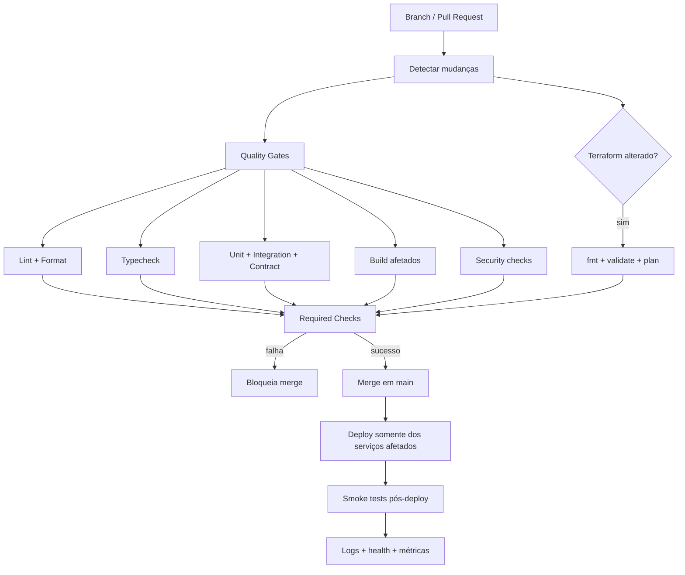

# CI/CD — Financial MFE Hub

Este documento detalha a estratégia operacional de **Continuous Integration** e **Continuous Delivery/Deployment** do Financial MFE Hub.

O objetivo é manter o projeto em nível de engenharia próximo a ambientes corporativos reais, sem adicionar complexidade apenas para aumentar a stack.

A arquitetura principal utiliza **GitHub Actions + Turborepo + Render + Terraform**.

---

## 1. Princípios

### 1.1 PR como unidade de validação

Toda mudança entra por Pull Request e deve provar que está pronta antes do merge.

Nenhum deploy de produção deve ser utilizado para descobrir problemas que poderiam ser detectados por lint, typecheck, testes, build ou validações de infraestrutura.

### 1.2 `main` sempre publicável

A branch `main` deve permanecer em estado publicável.

Merge só ocorre após os checks obrigatórios passarem.

### 1.3 Deploy independente

Cada unidade deve poder evoluir e ser publicada de forma independente:

```text
shell
├── dashboard-mfe
├── accounts-mfe
├── payments-mfe
├── insurance-mfe
└── bff
```

Publicar `payments-mfe` não deve obrigar novo deploy de `accounts-mfe` ou `insurance-mfe`.

### 1.4 Mudanças afetadas, não o monorepo inteiro

Turborepo deve ser utilizado para identificar e executar trabalho somente nos apps/packages afetados quando isso for seguro.

Dependências compartilhadas continuam propagando impacto para seus consumidores.

### 1.5 Infraestrutura revisável

Alterações Terraform passam por `fmt`, `validate` e `plan` antes de qualquer `apply`.

Mudanças destrutivas exigem revisão explícita.

### 1.6 Segredos fora do código

Secrets não entram em:

- Git;
- bundle do navegador;
- logs;
- artefatos públicos;
- outputs Terraform sem necessidade.

---

## 2. Fluxo de alto nível



---

## 3. Workflows previstos

Estrutura alvo:

```text
.github/workflows/
├── ci.yml
├── e2e.yml
├── terraform-plan.yml
├── terraform-apply.yml
├── deploy.yml
├── smoke.yml
└── security.yml
```

A separação pode evoluir durante a implementação, mas responsabilidades diferentes não devem virar um único workflow monolítico difícil de diagnosticar.

---

## 4. CI de Pull Request

Triggers principais:

```text
pull_request -> main
workflow_dispatch
```

### 4.1 Bootstrap

Passos base:

```text
checkout
setup Node
setup pnpm
pnpm install --frozen-lockfile
restore cache quando aplicável
```

Versões de Node e pnpm devem vir da configuração canônica do repositório, evitando versões divergentes por workflow.

### 4.2 Gates obrigatórios

```text
pnpm format:check
pnpm lint
pnpm typecheck
pnpm test
pnpm build
```

E2E pode ficar em job separado devido ao custo e tempo de execução.

### 4.3 Concorrência

Novos commits na mesma PR devem cancelar execuções antigas quando o resultado anterior deixar de ser relevante.

Objetivo:

```text
commit A -> CI em execução
commit B -> cancela A -> executa B
```

Isso reduz uso desnecessário de runners e feedback atrasado.

### 4.4 Permissões mínimas

GitHub Actions deve declarar somente as permissões necessárias para cada workflow.

Workflows de validação não recebem permissão de escrita/deploy sem necessidade.

---

## 5. Estratégia Turborepo / affected

O monorepo não deve executar todos os builds indiscriminadamente para sempre.

Exemplos conceituais:

```text
mudou payments-mfe
-> validar payments-mfe

mudou packages/ui
-> validar consumidores de packages/ui

mudou packages/contracts
-> validar MFEs + BFF que dependem dos contratos
```

O grafo de dependências do Turborepo deve ser a fonte para propagação de impacto.

### Cache

Cache pode reduzir tempo de CI, mas nunca substituir execução necessária nem esconder incompatibilidades.

Inputs de cache devem considerar arquivos que realmente alteram o resultado da task.

---

## 6. Estratégia de testes no pipeline

### Unitários / componentes

Executados em toda PR afetada.

Ferramentas:

```text
Jest
React Testing Library
```

### Integração

MSW cobre comunicação frontend e cenários de falha previsíveis.

### BFF

`Fastify.inject()` valida endpoints sem depender de servidor externo.

### Contratos

Mudança incompatível em contrato público deve falhar antes do deploy ou possuir migração coordenada explícita.

### E2E

Playwright cobre jornadas críticas cross-MFE.

No mínimo:

```text
Shell monta
navegação entre MFEs funciona
formulário funciona
BFF responde
falha de remote possui fallback
```

---

## 7. Security gates

O pipeline deve evoluir para incluir, quando disponível no repositório/plano:

- dependency review;
- CodeQL ou análise equivalente;
- Dependabot;
- detecção de secrets;
- validação de dependências vulneráveis;
- proteção de branch;
- revisão obrigatória para mudanças de infraestrutura sensíveis.

Checks de segurança devem ser acionáveis e não existir apenas para produzir ruído.

---

## 8. Terraform CI

Mudanças em `infrastructure/terraform/**` acionam validação específica.

### Pull Request

```text
terraform fmt -check
terraform init
terraform validate
terraform plan
```

O `plan` deve ficar disponível como evidência para revisão sem expor secrets.

### Production apply

`terraform apply` não executa em PR.

Ele ocorre apenas após merge aprovado e usando um GitHub Environment protegido ou execução manual equivalente.

```text
PR
 -> plan
 -> review
 -> merge
 -> approval protegido
 -> apply
```

O state nunca é versionado.

Drift detection periódico pode ser adicionado quando houver valor operacional real.

---

## 9. Estratégia de CD — Render

A aplicação roda oficialmente no Render.

O projeto deve aproveitar o suporte do Render a deploy Git-based e integração com checks de CI, preservando os quality gates antes da publicação.

### Regra principal

```text
push/merge main
      │
      ▼
required CI checks
      │
      ├── falhou -> sem deploy
      │
      └── passou
             │
             ▼
      Render deploy afetado
```

Cada serviço deve possuir filtro/root apropriado ao monorepo para evitar deploy quando arquivos sem relação forem alterados.

### Serviços

```text
financial-mfe-shell
financial-mfe-dashboard
financial-mfe-accounts
financial-mfe-payments
financial-mfe-insurance
financial-mfe-bff
```

Os nomes finais podem variar, mas o isolamento operacional permanece.

### Estratégia a validar na FMH-046

Duas alternativas são aceitáveis e devem ser comparadas antes da implementação definitiva:

1. **Render deploy após CI checks passarem**;
2. **GitHub Actions controlando o deploy via Render API/CLI/deploy hooks**.

Critérios para decisão:

- simplicidade;
- controle de ordem;
- facilidade de rollback;
- independência entre MFEs;
- quantidade de secrets necessários;
- capacidade de observar o deploy;
- facilidade de executar smoke tests.

A escolha final gera ADR se o trade-off for relevante.

---

## 10. Runtime manifest e release identity

O Shell não deve depender de URLs espalhadas no código.

Uma configuração/manifest central deve resolver a versão publicada de cada remote.

Exemplo conceitual:

```json
{
  "dashboard": {
    "url": "https://.../remoteEntry.js",
    "version": "git-sha"
  },
  "payments": {
    "url": "https://.../remoteEntry.js",
    "version": "git-sha"
  }
}
```

A versão deve permitir relacionar:

```text
commit Git
-> workflow
-> deploy
-> remote publicado
-> log/erro
```

Quando possível, utilizar o commit SHA disponibilizado pelo ambiente de deploy como release identity.

---

## 11. Smoke tests pós-deploy

Deploy bem-sucedido não significa aplicação saudável.

Após publicação, validar:

```text
Shell responde
runtime manifest responde
remoteEntry esperado responde
MFE monta
BFF /health responde
fluxo crítico mínimo responde
```

Falha de smoke test deve produzir evidência clara e acionar o procedimento de rollback.

---

## 12. Rollback

Rollback deve ser planejado antes de ser necessário.

### MFE

Um remote deve poder retornar para uma versão conhecida sem republicar todos os outros MFEs.

```text
payments v1.4 -> falha
manifest / release config
payments v1.3 -> restauração
```

### BFF

A estratégia deve considerar o último deploy saudável disponível no Render e compatibilidade com contratos ainda consumidos pelos MFEs publicados.

Rollback de backend não pode quebrar um frontend que já passou a depender exclusivamente de um contrato novo incompatível.

---

## 13. Compatibilidade de deploy

Deploy independente exige compatibilidade durante rollout.

Exemplo proibido:

```text
BFF remove campo imediatamente
Payments antigo ainda depende dele
-> produção quebra
```

Preferência:

```text
BFF adiciona nova versão/shape compatível
Payments migra
consumidores antigos deixam de usar contrato anterior
campo antigo é removido em alteração posterior
```

Contratos públicos e módulos federados devem ser tratados como APIs versionáveis.

---

## 14. Branch protection

`main` deve possuir proteção compatível com o projeto.

Esperado:

- PR obrigatório;
- required status checks;
- branch atualizada antes de merge quando necessário;
- impedir force push;
- impedir exclusão acidental;
- revisão humana para alterações sensíveis quando aplicável.

A política pode ser reduzida em um repositório individual, mas a arquitetura deve demonstrar conhecimento do fluxo corporativo.

---

## 15. Ambientes

Inicialmente:

```text
local
production/demo
```

Não criar staging permanente apenas para marcar uma caixa arquitetural.

Quando previews forem úteis e compatíveis com custo/plano, podem ser utilizados para revisão visual e integração sem alterar produção.

---

## 16. Observabilidade do pipeline

O pipeline precisa responder:

```text
qual commit foi validado?
qual task falhou?
qual app foi afetado?
qual serviço foi publicado?
qual versão está em produção?
o smoke pós-deploy passou?
como voltar para a versão anterior?
```

Logs de CI não devem expor secrets.

---

## 17. Definition of Done relacionada a CI/CD

Uma entrega que afeta comportamento publicável só está concluída quando, conforme aplicável:

- quality gates passam;
- testes relevantes passam;
- build do app afetado passa;
- alteração Terraform possui plan revisável;
- serviço correto pode ser publicado independentemente;
- deploy possui release identity;
- smoke test confirma saúde;
- documentação/ADR está atualizada;
- existe estratégia de rollback para mudança operacional relevante.

---

## 18. Resultado esperado

O fluxo final deve se aproximar de:

```text
Developer
   │
   ▼
Pull Request
   │
   ├── format/lint
   ├── typecheck
   ├── unit/integration
   ├── contracts
   ├── build affected
   ├── security
   └── terraform plan (quando afetado)
   │
   ▼
Required checks
   │
   ▼
Merge main
   │
   ▼
Deploy somente afetados
   │
   ▼
Smoke tests
   │
   ├── OK -> produção saudável
   └── FAIL -> evidência + rollback
```

O objetivo não é ter muitos workflows, e sim possuir um fluxo previsível, auditável, seguro e reproduzível.