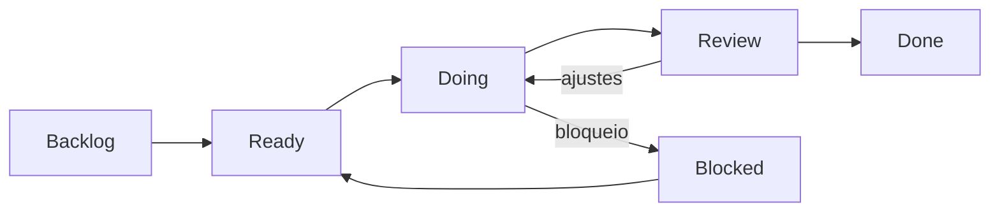

# Contexto do projeto

Este diretório concentra a documentação canônica do **Financial MFE Hub**.

A intenção é manter decisões, arquitetura e execução próximas do código, evitando documentação distribuída em múltiplos lugares sem uma fonte clara de verdade.

## Documentos

### [`SDD.md`](./SDD.md)

Software Design Document do projeto.

Contém:

- contexto e objetivos;
- princípios arquiteturais;
- fronteiras entre Shell, MFEs, BFF e packages;
- Single-SPA e Module Federation;
- contratos Zod compartilhados;
- estratégia de formulários;
- autenticação e autorização;
- estado e comunicação entre MFEs;
- segurança, performance e observabilidade;
- testes;
- CI/CD e estratégia de deploy;
- critérios arquiteturais de aceite.

### [`PROJECT-TASKS.md`](./PROJECT-TASKS.md)

Backlog técnico incremental e rastreável.

Cada task deve representar uma entrega pequena, validável e com evidência objetiva de conclusão.

## Fluxo de execução



### Estados

- **BACKLOG**: identificada, mas ainda não refinada para execução;
- **READY**: escopo, dependências e aceite definidos;
- **DOING**: implementação em andamento;
- **REVIEW**: código e evidências prontos para revisão;
- **BLOCKED**: impedimento explícito documentado;
- **DONE**: critérios de aceite e Definition of Done cumpridos.

## Regra de rastreabilidade

As tasks usam o prefixo `FMH`:

```text
FMH-001
FMH-002
FMH-003
...
```

Commits relacionados a uma task devem, quando fizer sentido, citar seu identificador:

```text
feat(shell): bootstrap single-spa root config [FMH-004]
```

Uma task só pode ser considerada concluída quando houver evidência suficiente para reproduzir sua validação.