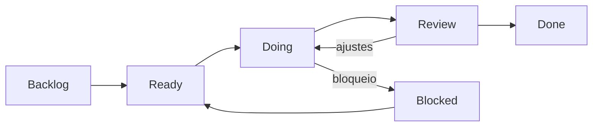

# Contexto do projeto

Este diretório concentra a documentação canônica do **Financial MFE Hub**.

A intenção é manter decisões, arquitetura e execução próximas do código, evitando documentação distribuída em múltiplos lugares sem uma fonte clara de verdade.

## Documentos

### [`SDD.md`](./SDD.md)

Software Design Document do projeto.

Contém:

- contexto e objetivos;
- princípios arquiteturais;
- fronteiras entre Shell, MFEs, BFF e packages;
- Single-SPA e Module Federation;
- contratos Zod compartilhados;
- estratégia de formulários;
- autenticação e autorização;
- estado e comunicação entre MFEs;
- internacionalização;
- segurança, performance e observabilidade;
- testes;
- CI/CD, Terraform e estratégia de deploy;
- critérios arquiteturais de aceite.

### [`CI-CD.md`](./CI-CD.md)

Especificação operacional detalhada do pipeline do projeto.

Contém:

- GitHub Actions e quality gates;
- execução por mudanças afetadas com Turborepo;
- testes unitários, integração, contratos e E2E no pipeline;
- security gates;
- Terraform `fmt`, `validate`, `plan` e `apply` protegido;
- deploy independente de Shell, MFEs e BFF no Render;
- estratégia Render após checks de CI vs deploy controlado por Actions;
- runtime manifest e release identity;
- smoke tests pós-deploy;
- rollback e compatibilidade entre versões;
- branch protection e rastreabilidade operacional.

### [`PROJECT-TASKS.md`](./PROJECT-TASKS.md)

Backlog técnico incremental e rastreável.

Cada task deve representar uma entrega pequena, validável e com evidência objetiva de conclusão.

### [`adr/ADR-001-architecture-validation-first.md`](./adr/ADR-001-architecture-validation-first.md)

Decisão que estabelece **Architecture Validation First** como estratégia inicial do projeto.

Antes de aprofundar regras de negócio, o case deve provar a plataforma com Shell, MFEs visuais mínimos, BFF `/health`, CI/CD, Terraform + Render, runtime config, smoke tests e rollback.

Os stubs usam identidades visuais distintas para facilitar diagnóstico durante a validação arquitetural:

```text
Dashboard -> azul
Accounts  -> verde
Payments  -> roxo
Insurance -> laranja
```

A UI inicial é propositalmente simples e não representa o design final do produto.

## Fluxo de execução



### Estados

- **BACKLOG**: identificada, mas ainda não refinada para execução;
- **READY**: escopo, dependências e aceite definidos;
- **DOING**: implementação em andamento;
- **REVIEW**: código e evidências prontos para revisão;
- **BLOCKED**: impedimento explícito documentado;
- **DONE**: critérios de aceite e Definition of Done cumpridos.

## Regra de rastreabilidade

As tasks usam o prefixo `FMH`:

```text
FMH-001
FMH-002
FMH-003
...
```

Toda alteração versionada deve estar vinculada a uma task. O identificador entra no próprio commit para manter rastreabilidade entre planejamento, implementação e histórico Git.

Formato padrão:

```text
<tipo>: <TASK-ID> - <descrição em pt-BR>
```

Exemplos:

```text
feat: FMH-001 - consolida SDD e arquitetura inicial
feat: FMH-005 - cria shell com orquestração single-spa
fix: FMH-029 - corrige reenvio da transferência
refactor: FMH-018 - separa bootstrap do fastify
```

O tipo segue Conventional Commits (`feat`, `fix`, `refactor`, `test`, `chore` etc.), enquanto a descrição permanece em PT-BR.

A documentação e o próprio SDD também fazem parte do fluxo de tasks. Portanto, alterações arquiteturais não ficam fora da rastreabilidade apenas por não modificarem código de produção.

Uma task só pode ser considerada concluída quando houver evidência suficiente para reproduzir sua validação.
