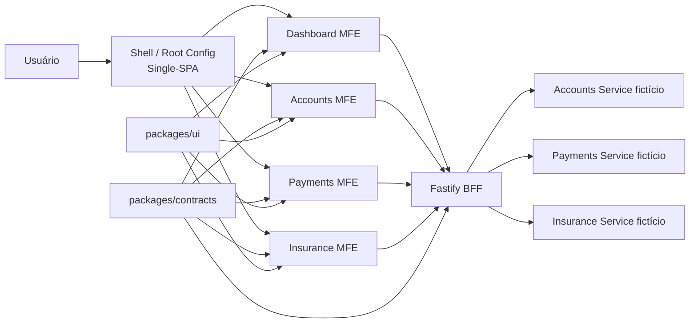
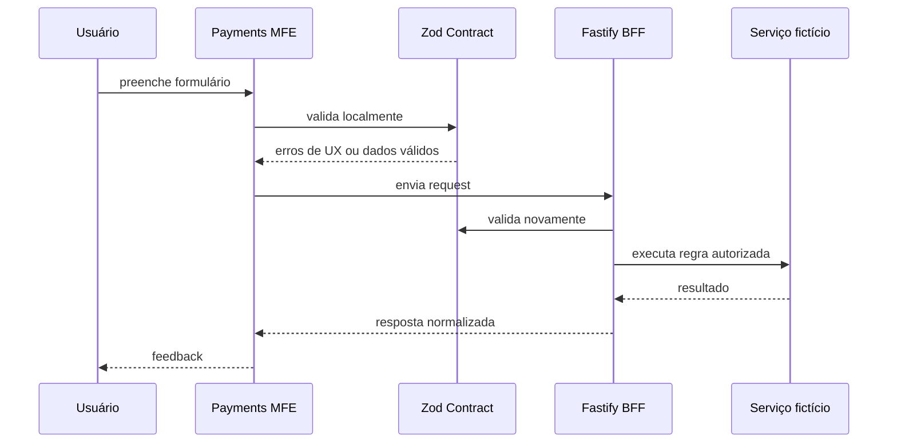

# SDD — Financial MFE Hub

## 1. Visão geral

O **Financial MFE Hub** é uma POC de arquitetura distribuída de front-end voltada a um domínio financeiro fictício.

O objetivo principal não é reproduzir um banco real, mas exercitar problemas técnicos comuns em aplicações corporativas de alta criticidade:

- múltiplos times e domínios de front-end;
- autonomia de desenvolvimento e deploy;
- composição de aplicações em runtime;
- compartilhamento controlado de módulos;
- contratos tipados entre front-end e backend;
- BFF como fronteira de integração;
- segurança, observabilidade, performance e testes;
- documentação orientada a decisões e tarefas incrementais.

O projeto deve permanecer compreensível como portfólio técnico. Toda complexidade introduzida precisa ter uma justificativa arquitetural explícita.

---

## 2. Objetivos

### 2.1 Objetivos funcionais

A POC deve fornecer uma experiência fictícia de hub financeiro com, no mínimo:

- dashboard consolidado;
- visualização de contas;
- visualização de cartões e limites;
- fluxo fictício de pagamentos e transferências;
- área fictícia de seguros;
- autenticação simulada ou controlada;
- tratamento consistente de erros e indisponibilidades.

### 2.2 Objetivos arquiteturais

O projeto deve demonstrar:

1. composição de Micro Frontends com Single-SPA;
2. compartilhamento de módulos com Webpack Module Federation;
3. monorepo com pnpm + Turborepo;
4. contratos Zod reutilizados entre front-end, BFF e testes;
5. BFF em Fastify;
6. isolamento de responsabilidades entre MFEs;
7. deploy independente por aplicação;
8. testes unitários, integração e E2E;
9. observabilidade básica e tratamento de falhas;
10. pipeline CI/CD reproduzível.

### 2.3 Não objetivos

Não faz parte da POC inicial:

- integração com instituições financeiras reais;
- movimentação financeira real;
- armazenamento de dados bancários reais;
- implementação completa de Open Finance;
- compliance regulatório completo;
- event streaming distribuído;
- arquitetura multi-região;
- alta disponibilidade de produção real.

Esses tópicos podem ser discutidos como evolução, mas não devem inflar o MVP.

---

## 3. Princípios de arquitetura

### 3.1 Fronteiras explícitas

Cada aplicação deve possuir uma responsabilidade clara. Um MFE não deve acessar diretamente detalhes internos de outro MFE.

### 3.2 Contratos antes de implementação

Entradas e saídas relevantes devem possuir contratos explícitos. Zod será a principal ferramenta de validação runtime e inferência de tipos.

### 3.3 Backend como autoridade

Validação no front existe para UX. Toda entrada que chegar ao BFF deve ser considerada não confiável e validada novamente.

### 3.4 Compartilhar apenas o necessário

Module Federation não deve transformar todos os MFEs em aplicações fortemente acopladas. Compartilhamento runtime deve ser deliberado.

### 3.5 Independência de deploy

Os MFEs devem ser construídos de forma que possam evoluir e ser publicados independentemente, mesmo estando no mesmo monorepo.

### 3.6 Falhas isoladas

Uma falha em um MFE não deve, sempre que tecnicamente possível, derrubar toda a experiência.

### 3.7 Complexidade justificável

A POC existe para estudar MFE. Ainda assim, abstrações sem necessidade real devem ser evitadas.

---

## 4. Visão de alto nível



---

## 5. Estrutura do monorepo

```text
apps/
├── shell/
├── dashboard-mfe/
├── accounts-mfe/
├── payments-mfe/
├── insurance-mfe/
└── bff/

packages/
├── context/
├── contracts/
├── ui/
├── auth/
├── eslint-config/
└── typescript-config/
```

### 5.1 `apps/shell`

Responsável por:

- bootstrap da aplicação;
- registro dos MFEs no Single-SPA;
- resolução de rotas;
- layout estrutural global;
- fallback global;
- descoberta/configuração dos remotes;
- composição de navegação global.

Não deve conter regras de domínio de Accounts, Payments ou Insurance.

### 5.2 `apps/dashboard-mfe`

Responsável por:

- visão consolidada;
- resumo de saldos fictícios;
- cards de atalhos;
- indicadores simples;
- composição somente via contratos públicos.

### 5.3 `apps/accounts-mfe`

Responsável por:

- contas;
- cartões;
- limites;
- detalhes relacionados ao domínio de Accounts.

### 5.4 `apps/payments-mfe`

Responsável por:

- PIX fictício;
- boleto fictício;
- transferências fictícias;
- formulários e confirmações do domínio de Payments.

### 5.5 `apps/insurance-mfe`

Responsável por:

- produtos de seguro fictícios;
- simulações;
- seguros contratados fictícios.

### 5.6 `apps/bff`

Responsável por:

- expor endpoints adequados às necessidades do front-end;
- validar requests;
- autenticar e autorizar operações;
- agregar respostas de serviços;
- normalizar erros;
- aplicar regras que dependem de dados externos;
- ocultar detalhes das APIs downstream.

### 5.7 `packages/contracts`

Responsável por:

- schemas Zod;
- tipos inferidos;
- DTOs compartilhados;
- enums de contrato;
- schemas de query params;
- schemas de resposta quando fizer sentido.

Não deve conter regra de negócio dependente de persistência ou infraestrutura.

### 5.8 `packages/ui`

Responsável por:

- componentes visuais reutilizáveis;
- tokens de design;
- acessibilidade base;
- componentes sem regra de domínio.

### 5.9 `packages/auth`

Responsável por abstrações públicas de autenticação utilizadas pelos MFEs, sem expor implementação sensível.

---

## 6. Single-SPA

Single-SPA será o mecanismo de orquestração das aplicações.

O Shell deve registrar aplicações com regras de ativação explícitas.

Exemplo conceitual:

```text
/dashboard  -> dashboard-mfe
/accounts   -> accounts-mfe
/payments   -> payments-mfe
/insurance  -> insurance-mfe
```

Cada MFE deve suportar o ciclo de vida esperado:

```text
bootstrap
mount
unmount
```

### 6.1 Regra de ownership de rotas

Cada rota de domínio deve possuir um único owner principal.

Exemplo:

```text
/accounts/*   -> accounts-mfe
/payments/*   -> payments-mfe
```

O Shell controla roteamento global. O roteamento interno de cada domínio pode ser controlado pelo próprio MFE.

### 6.2 Falha de carregamento

Se um MFE falhar ao carregar:

- o Shell permanece operacional;
- uma fallback UI é exibida;
- o erro é registrado;
- deve existir ação de retry quando aplicável.

---

## 7. Module Federation

Module Federation será utilizado para estudar compartilhamento runtime entre aplicações.

### 7.1 Casos permitidos

Inicialmente, serão priorizados casos de uso controlados:

- componentes de navegação ou composição realmente necessários em runtime;
- módulos de integração do Shell;
- eventual compartilhamento de widgets cross-domain com ownership explícito.

### 7.2 Shared dependencies

Dependências críticas devem evitar múltiplas instâncias quando isso causar problemas de runtime.

Candidatas a `shared singleton`:

- React;
- React DOM;
- bibliotecas cuja duplicação quebre contextos globais.

A configuração deve ser mínima e documentada.

### 7.3 Regra contra acoplamento

Um MFE não deve importar internals arbitrários de outro.

Interfaces federadas são APIs públicas. Alterações incompatíveis precisam ser tratadas como breaking changes.

---

## 8. Monorepo e Turborepo

Turborepo será responsável por coordenar tarefas do workspace.

Pipelines previstos:

```text
lint
format:check
typecheck
test
build
e2e
```

As dependências entre tarefas devem refletir as dependências reais entre packages e apps.

O monorepo simplifica desenvolvimento e padronização, mas não elimina a meta de independência de deploy.

---

## 9. Contratos Zod

Os contratos compartilhados seguem o princípio:

```text
Definir uma vez -> inferir tipos -> validar em todas as fronteiras relevantes
```

Exemplo:

```ts
import { z } from 'zod';

export const transferSchema = z.object({
  destinationAccount: z.string().min(1),
  amount: z.number().positive(),
  description: z.string().max(140).optional(),
});

export type TransferInput = z.infer<typeof transferSchema>;
```

### 9.1 Front-end

O schema pode ser conectado ao formulário para:

- required;
- formato;
- limites;
- enumerações;
- coerência local simples.

### 9.2 BFF

O BFF valida novamente o request usando o mesmo contrato.

Nunca confiar em validação client-side.

### 9.3 O que não vai para Zod compartilhado

Regras dependentes de estado externo não pertencem ao contrato compartilhado.

Exemplos:

```text
amount > 0                         -> Zod compartilhado
saldo disponível >= amount        -> domínio/BFF
conta de destino existe           -> domínio/BFF
usuário pode operar aquela conta  -> autorização/BFF
```

---

## 10. Formulários

A estratégia deve evitar duplicação manual de regras entre front e backend.

Fluxo:



O front deve mapear erros de contrato de maneira consistente para os campos.

Erros de regra de negócio devem ser representados por códigos estáveis, não por parsing de mensagens humanas.

---

## 11. BFF com Fastify

O BFF é uma camada de adaptação entre a experiência frontend e os serviços fictícios.

### 11.1 Responsabilidades

- autenticação;
- autorização;
- validação runtime;
- agregação;
- transformação de DTOs;
- normalização de erros;
- correlação de requests;
- logging;
- rate limiting quando aplicável.

### 11.2 O que o BFF não deve virar

O BFF não deve virar um backend monolítico com regras de todos os domínios misturadas.

A organização interna deve separar módulos:

```text
src/
├── modules/
│   ├── accounts/
│   ├── payments/
│   └── insurance/
├── plugins/
├── shared/
└── server.ts
```

Cada módulo deve separar HTTP, aplicação e integração quando necessário.

---

## 12. Estado no front-end

### 12.1 Estado de servidor

TanStack Query será responsável por:

- fetching;
- cache;
- loading/error states;
- invalidação;
- retry controlado.

### 12.2 Estado global local

Zustand só deve ser utilizado quando existir estado client-side realmente global.

Não deve substituir TanStack Query para dados originados do servidor.

### 12.3 Estado entre MFEs

Evitar store global compartilhada entre MFEs.

Preferência:

1. URL;
2. BFF/server state;
3. eventos públicos bem definidos;
4. módulo federado de integração apenas quando necessário.

---

## 13. Comunicação entre MFEs

A comunicação deve ser mínima e explícita.

### Estratégias preferidas

- navegação por URL;
- contratos públicos;
- eventos de domínio frontend quando justificável;
- Module Federation para módulos públicos específicos.

### Evitar

- importar store interna de outro MFE;
- manipular DOM de outro MFE;
- acessar internals privados de outro app;
- depender de ordem implícita de carregamento.

---

## 14. Autenticação e autorização

A POC deve diferenciar autenticação de autorização.

### 14.1 Autenticação

Preferência arquitetural:

- sessão/token controlado pelo BFF;
- cookie `HttpOnly` quando houver sessão real na POC;
- evitar armazenar tokens sensíveis em `localStorage`.

### 14.2 Autorização

O front pode esconder ações para UX, mas autorização real é responsabilidade do BFF.

Exemplo:

```text
Botão não renderizado -> UX
BFF rejeita operação não autorizada -> segurança
```

---

## 15. Modelo de erros

O BFF deve retornar formato consistente.

Exemplo conceitual:

```json
{
  "error": {
    "code": "INSUFFICIENT_BALANCE",
    "message": "Saldo insuficiente.",
    "requestId": "..."
  }
}
```

Categorias iniciais:

- `VALIDATION_ERROR`;
- `UNAUTHENTICATED`;
- `FORBIDDEN`;
- `NOT_FOUND`;
- `CONFLICT`;
- `DOWNSTREAM_UNAVAILABLE`;
- `INTERNAL_ERROR`.

Mensagens de infraestrutura não devem vazar para o cliente.

---

## 16. Segurança

Mesmo sendo POC, devem ser demonstradas boas práticas.

### Requisitos mínimos

- headers de segurança;
- CORS restrito;
- cookies seguros quando utilizados;
- validação runtime;
- sanitização quando aplicável;
- secrets fora do Git;
- rate limiting em endpoints sensíveis quando aplicável;
- ausência de dados financeiros reais;
- logs sem informações sensíveis.

### Trust boundaries

```text
Browser -> não confiável
Request -> não confiável
BFF -> valida e autoriza
Serviços downstream -> respostas também precisam de tratamento
```

---

## 17. Performance

A POC deve medir e discutir performance, não apenas mencionar otimização.

### Métricas principais

- LCP;
- INP;
- CLS;
- tamanho dos bundles;
- tempo de carregamento dos remotes;
- waterfall de requests.

### Estratégias

- lazy loading por rota/MFE;
- evitar duplicação de React;
- split de bundles;
- cache de assets com hash;
- preload apenas quando justificado;
- minimizar shared modules excessivos;
- analisar impacto de Module Federation no carregamento.

---

## 18. Resiliência

Falhas devem ser tratadas em diferentes níveis.

### Shell

- fallback para MFE indisponível;
- retry controlado;
- registro do erro.

### MFE

- error boundaries;
- empty states;
- loading states;
- tratamento de timeout;
- mensagens de erro acionáveis.

### BFF

- timeout para downstream;
- normalização de falhas;
- request correlation;
- retry apenas em operações idempotentes quando seguro.

---

## 19. Observabilidade

A implementação inicial deve suportar:

- logs estruturados no BFF;
- `requestId`/correlation id;
- logging de falha de carregamento de MFE;
- métricas básicas de erro e latência;
- possibilidade futura de OpenTelemetry.

Logs devem permitir responder:

```text
qual request falhou?
qual MFE originou a ação?
qual endpoint foi chamado?
qual downstream falhou?
quanto tempo levou?
```

---

## 20. Testes

A estratégia segue a pirâmide de testes sem perseguir cobertura artificial.

### 20.1 Unitários

Ferramentas:

- Jest;
- React Testing Library.

Cobrir:

- hooks;
- componentes com comportamento;
- mapeadores;
- regras puras;
- validações auxiliares.

### 20.2 Integração frontend

Usar MSW para simular APIs em cenários de:

- sucesso;
- erro de validação;
- erro de autorização;
- indisponibilidade;
- resposta lenta.

### 20.3 BFF

Usar `Fastify.inject()` para testar endpoints sem depender de servidor externo.

Validar:

- contrato;
- status code;
- autenticação;
- autorização;
- transformação de payload;
- normalização de erro.

### 20.4 E2E

Playwright deve validar jornadas cross-MFE.

Exemplos:

- autenticar e abrir dashboard;
- navegar de Accounts para Payments;
- preencher transferência inválida;
- concluir fluxo fictício válido;
- tratar indisponibilidade de um remote.

---

## 21. Storybook

`packages/ui` deve possuir catálogo isolado.

Objetivos:

- documentar API dos componentes;
- validar estados;
- reduzir dependência de execução dos MFEs;
- facilitar consistência visual.

Componentes de domínio não devem ser movidos para `packages/ui` apenas para aumentar reutilização aparente.

---

## 22. CI

GitHub Actions deve executar, no mínimo:

```text
pnpm install --frozen-lockfile
pnpm lint
pnpm typecheck
pnpm test
pnpm build
```

E2E pode rodar em job separado.

PR não deve ser considerada válida se gates obrigatórios falharem.

---

## 23. CD e deploy

A arquitetura deve permitir deploy independente.

Modelo inicial:

```text
shell              -> deployment próprio
dashboard-mfe      -> deployment próprio
accounts-mfe       -> deployment próprio
payments-mfe       -> deployment próprio
insurance-mfe      -> deployment próprio
bff                -> deployment próprio
```

O Shell deve descobrir os remotes por configuração de ambiente, evitando URLs hardcoded espalhadas pelo código.

### Evolução AWS opcional

Uma fase posterior pode demonstrar:

- S3 para assets estáticos;
- CloudFront como CDN;
- CloudWatch para logs/métricas;
- Lambda em um caso de uso pontual.

AWS não é requisito do primeiro bootstrap da POC.

---

## 24. Configuração por ambiente

Variáveis públicas e privadas devem ser claramente separadas.

Exemplos conceituais:

```text
SHELL_DASHBOARD_REMOTE_URL
SHELL_ACCOUNTS_REMOTE_URL
SHELL_PAYMENTS_REMOTE_URL
SHELL_INSURANCE_REMOTE_URL
BFF_BASE_URL
```

Secrets do BFF nunca devem ser expostos no bundle do navegador.

---

## 25. Versionamento de contratos

Como todos os apps estarão inicialmente no mesmo monorepo, mudanças de contrato podem ser verificadas no mesmo pipeline.

Ainda assim, contratos devem ser tratados como APIs públicas.

Mudanças incompatíveis precisam:

- ser identificadas;
- possuir migração coordenada;
- evitar quebra silenciosa entre deployments independentes.

---

## 26. Estratégia de evolução

### Fase 1 — Fundação

- workspace;
- configs compartilhadas;
- Shell;
- primeiro MFE;
- contracts;
- BFF mínimo.

### Fase 2 — Composição MFE

- múltiplos MFEs;
- rotas;
- lifecycles;
- error boundaries;
- runtime config.

### Fase 3 — Module Federation

- remote público;
- consumo runtime;
- shared dependencies;
- testes de compatibilidade.

### Fase 4 — Domínio e formulários

- Accounts;
- Payments;
- Insurance;
- schemas Zod compartilhados;
- validação frontend + backend.

### Fase 5 — Qualidade

- Jest/RTL;
- MSW;
- Fastify.inject;
- Playwright;
- Storybook.

### Fase 6 — Operação

- CI;
- deployments independentes;
- observabilidade;
- performance;
- documentação de trade-offs.

### Fase 7 — Cloud opcional

- S3;
- CloudFront;
- CloudWatch;
- Lambda quando houver caso de uso real.

---

## 27. Critérios arquiteturais de aceite

A POC será considerada arquiteturalmente válida quando:

1. o Shell montar ao menos dois MFEs independentes;
2. os MFEs possuírem lifecycle funcional de mount/unmount;
3. ao menos um módulo for consumido via Module Federation;
4. React não for duplicado de maneira problemática entre host/remotes;
5. cada domínio possuir ownership de rota claro;
6. contratos Zod forem reutilizados por front e BFF;
7. o BFF revalidar entradas recebidas;
8. uma regra dependente de servidor existir exclusivamente no BFF/domínio;
9. falha de um MFE possuir fallback sem derrubar todo o Shell;
10. um fluxo E2E atravessar mais de um MFE;
11. os principais gates rodarem no CI;
12. existir evidência de build/deploy independente;
13. decisões e trade-offs relevantes estarem documentados.

---

## 28. Decisões iniciais

| Decisão | Escolha | Motivo |
| --- | --- | --- |
| Linguagem | TypeScript | contratos fortes em todo o workspace |
| Front | React | alinhamento com o objetivo da POC |
| Estilo | Tailwind CSS | produtividade e consistência |
| Orquestração | Single-SPA | estudar lifecycle e composição MFE |
| Runtime sharing | Webpack Module Federation | estudar remotes em runtime |
| Workspace | pnpm + Turborepo | organização, cache e pipelines |
| Contratos | Zod | validação runtime + tipos inferidos |
| BFF | Fastify | baixo overhead e boa DX em TypeScript |
| Server state | TanStack Query | cache e sincronização de API |
| Estado global | Zustand quando necessário | evitar complexidade sem necessidade |
| E2E | Playwright | jornadas cross-MFE |

---

## 29. Questões abertas

As seguintes decisões devem ser resolvidas durante as primeiras tasks:

1. usar `single-spa-layout` ou registro manual no Shell;
2. estratégia exata de integração Single-SPA + Module Federation;
3. mecanismo de runtime config dos remotes;
4. biblioteca de formulário: React Hook Form ou Formik;
5. estratégia de autenticação da POC;
6. onde publicar cada remote na primeira versão;
7. se o BFF usará persistência local, memória ou banco em fase posterior;
8. qual caso concreto justificará o primeiro módulo federado.

As respostas devem ser registradas no SDD antes ou junto da implementação correspondente.

---

## 30. Regra final

Nenhuma tecnologia deve entrar apenas para aparecer no README.

Toda adição relevante precisa responder pelo menos uma destas perguntas:

- qual problema resolve?
- qual fronteira melhora?
- qual risco reduz?
- qual conceito arquitetural demonstra?

Se não houver uma resposta clara, a tecnologia não entra na POC.