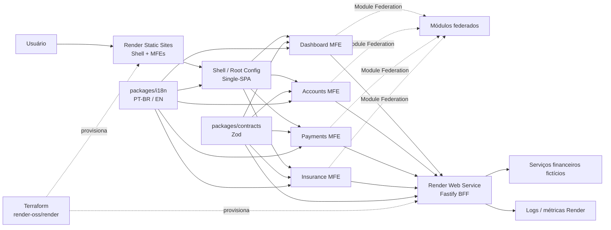

# SDD — Financial MFE Hub

## 1. Visão geral

O **Financial MFE Hub** é um case full-stack de arquitetura para um **hub financeiro fictício**. O projeto demonstra como Micro Frontends, contratos compartilhados, regras de negócio, interface, BFF, internacionalização, testes, observabilidade, CI/CD e infraestrutura podem evoluir juntos dentro de um monorepo.

O objetivo não é reproduzir uma instituição financeira real, mas construir um case técnico próximo de cenários corporativos de alta criticidade, com fronteiras claras, deploy independente, contratos explícitos e decisões arquiteturais rastreáveis.

> Todos os dados, usuários, saldos, contas, transações, seguros e regras de negócio são fictícios.

---

## 2. Objetivos arquiteturais

O case deve demonstrar, de forma prática e verificável:

1. composição de Micro Frontends com **Single-SPA**;
2. compartilhamento controlado de módulos em runtime com **Webpack Module Federation**;
3. monorepo com **pnpm + Turborepo**;
4. contratos runtime com **Zod** reutilizados entre front-end, BFF e testes;
5. formulários com **Formik + Zod**, preservando Context API e sem duplicação manual de regras portáveis;
6. BFF em **Node.js + Fastify**;
7. internacionalização com **PT-BR como idioma padrão** e **inglês** como alternativa;
8. separação entre estado de servidor, estado local e comunicação cross-MFE;
9. autenticação e autorização centralizadas no BFF;
10. testes unitários, integração, contrato e E2E;
11. medição de performance e Core Web Vitals;
12. observabilidade com logs estruturados e correlation id;
13. CI/CD reproduzível com **GitHub Actions**;
14. infraestrutura principal no **Render**, descrita por **Terraform**;
15. deploy independente por aplicação;
16. documentação de decisões, trade-offs e evolução por tasks;
17. uma trilha opcional de comparação com AWS, sem ser dependência do funcionamento do case.

---

## 3. Não objetivos

Não fazem parte do case principal:

- integração com instituições financeiras reais;
- movimentação financeira real;
- uso de dados bancários reais;
- Open Finance completo;
- compliance regulatório completo;
- arquitetura multi-região;
- alta disponibilidade de produção real;
- event streaming distribuído sem necessidade concreta;
- obrigatoriedade de AWS para execução da aplicação;
- adoção de tecnologia apenas para aumentar a lista de stack.

Toda complexidade precisa ter justificativa arquitetural explícita.

---

## 4. Princípios

### 4.1 Fronteiras explícitas

Cada domínio possui ownership claro. Um MFE não pode importar internals de outro MFE.

### 4.2 Contratos antes da implementação

Entradas, saídas e eventos relevantes devem possuir contratos explícitos antes da implementação correspondente.

### 4.3 Backend como autoridade

Validação client-side existe por UX. O BFF sempre revalida requests e continua responsável por autenticação, autorização e regras dependentes de estado externo.

### 4.4 Compartilhar apenas o necessário

Module Federation não deve transformar os MFEs em um monólito distribuído. Módulos federados são APIs públicas e devem possuir ownership e contrato claros.

### 4.5 Independência de deploy

Estar no mesmo monorepo não implica deploy conjunto. Cada aplicação deve possuir artefato e promoção independentes.

### 4.6 Falhas isoladas

A falha de um remote não deve derrubar o Shell nem outros domínios quando tecnicamente evitável.

### 4.7 Contexto local antes de estado global

Context API é preferida quando o estado pertence a um fluxo ou domínio React específico. Estado global cross-MFE deve ser evitado quando URL, BFF, eventos ou contratos públicos resolverem o problema com menos acoplamento.

### 4.8 Observabilidade e segurança por padrão

Logs, correlation id, validação runtime, secrets fora do Git e tratamento de erro fazem parte do desenho, não de uma etapa final.

### 4.9 Infraestrutura fiel ao ambiente real

O SDD deve descrever primeiro o ambiente que realmente será executado. AWS pode existir como laboratório opcional, mas não deve ser apresentada como infraestrutura principal se o case roda em Render.

---

## 5. Visão de alto nível



---

## 6. Stack definida

### Front-end

- React;
- TypeScript strict;
- Tailwind CSS;
- React Router;
- Single-SPA;
- Webpack 5;
- Module Federation;
- TanStack Query;
- Context API para estado de fluxo/domínio quando adequado;
- Zustand somente quando existir estado client-side realmente global dentro de um owner claro;
- Formik;
- Zod;
- i18next + react-i18next.

### BFF

- Node.js;
- Fastify;
- TypeScript;
- Zod;
- `fastify-type-provider-zod` ou integração equivalente;
- Swagger / OpenAPI;
- logging estruturado.

### Qualidade

- Jest;
- React Testing Library;
- MSW;
- Faker;
- Playwright;
- Storybook;
- ESLint;
- Prettier.

### Plataforma principal

- pnpm workspaces;
- Turborepo;
- GitHub Actions;
- Render Static Sites;
- Render Web Service;
- Terraform com provider `render-oss/render`.

### Trilha opcional de cloud

- AWS S3;
- AWS CloudFront;
- AWS Lambda;
- Amazon API Gateway;
- Amazon CloudWatch.

A trilha AWS é comparativa/educacional e não bloqueia a entrega principal.

---

## 7. Estrutura alvo

```text
apps/
├── shell/
├── dashboard-mfe/
├── accounts-mfe/
├── payments-mfe/
├── insurance-mfe/
└── bff/

packages/
├── context/
│   ├── README.md
│   ├── SDD.md
│   ├── PROJECT-TASKS.md
│   └── adr/
├── contracts/
├── ui/
├── auth/
├── i18n/
├── eslint-config/
└── typescript-config/

infrastructure/
└── terraform/
    ├── modules/
    │   ├── static-site/
    │   ├── web-service/
    │   └── shared/
    └── environments/
        └── production/
```

O diretório `packages/context` é a fonte canônica de arquitetura, decisões e execução do projeto.

---

## 8. Responsabilidades por aplicação

### `apps/shell`

Responsável por:

- bootstrap Single-SPA;
- registro e descoberta dos MFEs;
- navegação global;
- layout estrutural;
- fallback de remote;
- runtime config;
- coordenação de idioma;
- providers globais estritamente necessários;
- carregamento de dependências compartilhadas quando necessário.

Não contém regras de Accounts, Payments ou Insurance.

### `dashboard-mfe`

- visão consolidada;
- atalhos;
- indicadores fictícios;
- composição apenas por contratos públicos/BFF.

### `accounts-mfe`

- contas;
- cartões;
- limites;
- extrato fictício.

### `payments-mfe`

- PIX fictício;
- boleto fictício;
- transferências fictícias;
- formulários e confirmações.

### `insurance-mfe`

- produtos de seguro fictícios;
- simulações;
- seguros contratados fictícios.

### `apps/bff`

- autenticação;
- autorização;
- validação runtime;
- composição de respostas;
- adaptação de downstreams;
- regras que dependem de estado externo;
- logging e correlation id;
- normalização de erros.

---

## 9. Single-SPA

Single-SPA é o orquestrador de lifecycle e rota.

Rotas iniciais:

```text
/dashboard   -> dashboard-mfe
/accounts    -> accounts-mfe
/payments    -> payments-mfe
/insurance   -> insurance-mfe
```

Cada MFE deve suportar:

```text
bootstrap
mount
unmount
```

O Shell controla a ativação global; o roteamento interno de cada domínio pertence ao respectivo MFE.

### Falha de carregamento

Se um MFE falhar:

- Shell permanece operacional;
- fallback é exibido;
- retry pode ser oferecido;
- erro é registrado com nome do MFE, rota, ambiente e contexto.

---

## 10. Module Federation

Webpack Module Federation será usado para compartilhamento runtime controlado.

### Regras

- React e React DOM devem possuir estratégia explícita de singleton;
- nenhum MFE importa `src` interno de outro;
- todo módulo exposto é tratado como API pública;
- mudanças incompatíveis precisam de migração coordenada;
- não federar componentes apenas porque são reutilizáveis; componentes comuns preferencialmente vivem em `packages/ui`;
- federation deve demonstrar pelo menos um caso real de composição cross-domain ou shell integration.

### Cache de remotes

`remoteEntry.js` deve possuir política de cache/revalidação compatível com o comportamento do hosting. Chunks com hash podem usar cache mais agressivo.

O objetivo é evitar que o Shell consuma metadata antiga apontando para chunks que já não correspondem à versão publicada.

---

## 11. Monorepo e Turborepo

Turborepo coordena tarefas, cache e dependências do workspace.

Pipelines previstos:

```text
lint
format:check
typecheck
test
build
e2e
```

Turborepo não substitui MFE. O monorepo melhora DX; a independência existe no runtime e no deploy.

---

## 12. Contratos Zod

`packages/contracts` é a fonte canônica para contratos portáveis.

Princípio:

```text
Definir uma vez -> inferir tipos -> validar nas fronteiras
```

Exemplo:

```ts
export const transferSchema = z.object({
  destinationAccount: z.string().min(1),
  amount: z.number().positive(),
  description: z.string().max(140).optional(),
});
```

### Compartilhado

- required;
- formatos;
- limites;
- enumerações;
- DTOs;
- query params;
- schemas de resposta quando útil.

### Exclusivo do servidor

```text
amount > 0                         -> Zod compartilhado
saldo disponível >= amount        -> domínio/BFF
conta de destino existe           -> domínio/BFF
usuário pode operar aquela conta  -> autorização/BFF
```

Modelos de persistência não devem ser expostos diretamente como contratos HTTP.

---

## 13. Formulários e Context API

Formik será a biblioteca padrão de formulário.

Integração conceitual:

```text
Formik / FormikProvider
        │
        ├── estado do formulário
        ├── touched / errors / submit
        └── useFormikContext
                 │
                 ▼
       adapter Zod -> Formik errors
                 │
                 ▼
       packages/contracts
                 │
          ┌──────┴──────┐
          ▼             ▼
       Front UX       Fastify BFF
                     revalidação
```

### Regras

- Zod continua sendo a fonte canônica das regras portáveis;
- Formik controla o estado e lifecycle do formulário;
- um adapter converte `ZodError` para o shape esperado pelo Formik;
- não duplicar validações em funções paralelas ao schema;
- `FormikProvider` e `useFormikContext` podem ser usados para fluxos compostos dentro do mesmo MFE;
- Context API é local ao owner do domínio, salvo provider global explicitamente justificado;
- erros de domínio usam códigos estáveis, sem parsing de mensagens humanas.

### Context API entre MFEs

Não compartilhar um grande Context global contendo estado de Accounts, Payments e Insurance.

Preferir:

1. Context local ao MFE;
2. URL;
3. BFF/server state;
4. eventos públicos tipados;
5. Module Federation apenas quando houver contrato explícito.

---

## 14. BFF com Fastify

Estrutura conceitual:

```text
src/
├── modules/
│   ├── accounts/
│   ├── payments/
│   └── insurance/
├── plugins/
├── shared/
├── app.ts
└── server.ts
```

Cada módulo deve separar HTTP, aplicação e integração quando necessário.

O BFF não deve virar um monólito sem fronteiras internas.

### API documentation

OpenAPI/Swagger deve ser gerado a partir das definições da API sempre que possível, evitando documentação manual divergente.

---

## 15. Internacionalização

Idiomas suportados inicialmente:

```text
pt-BR -> padrão
en    -> alternativo
```

`packages/i18n` concentra configuração comum, tipos e primitivas de idioma.

### Ownership

- Shell é a fonte de verdade da preferência atual;
- cada MFE mantém seus próprios namespaces de tradução;
- mudança de idioma ocorre por contrato público;
- nenhum MFE acessa store interna de outro;
- preferência pode ser persistida no browser por ser configuração não sensível;
- `<html lang>` deve acompanhar o locale atual;
- textos retornados por erro de domínio devem preferir códigos estáveis, permitindo tradução no cliente quando adequado.

O sistema deve ter fallback explícito para `pt-BR`.

---

## 16. Estado e comunicação entre MFEs

### Server state

TanStack Query para fetching, cache, invalidação e retry controlado.

### Estado client-side local

Ordem de preferência:

1. estado local de componente;
2. Context API para fluxos/domínios React compostos;
3. Zustand apenas quando houver estado client-side global real dentro de um owner claro.

### Cross-MFE

Ordem de preferência:

1. URL;
2. server state/BFF;
3. custom props/contratos públicos do Shell;
4. eventos tipados;
5. módulo federado somente quando houver justificativa.

Evitar store ou Context global compartilhado entre todos os MFEs.

---

## 17. Autenticação e autorização

Preferência arquitetural:

- autenticação controlada pelo BFF;
- cookie `HttpOnly`, `Secure` e `SameSite` apropriado quando sessão for implementada;
- tokens sensíveis não ficam em `localStorage`;
- front pode esconder ações por UX, mas BFF valida permissão real;
- logs não registram tokens, cookies ou dados sensíveis.

---

## 18. Modelo de erros

Formato base:

```json
{
  "error": {
    "code": "INSUFFICIENT_BALANCE",
    "message": "Saldo insuficiente.",
    "requestId": "..."
  }
}
```

Categorias mínimas:

- `VALIDATION_ERROR`;
- `UNAUTHENTICATED`;
- `FORBIDDEN`;
- `NOT_FOUND`;
- `CONFLICT`;
- `DOWNSTREAM_UNAVAILABLE`;
- `INTERNAL_ERROR`.

Detalhes de infraestrutura nunca devem vazar ao navegador.

---

## 19. Segurança

Baseline mínimo:

- CORS restrito;
- headers de segurança;
- cookies seguros;
- validação runtime de request e configuração;
- rate limit em endpoints sensíveis quando aplicável;
- secrets fora do Git;
- princípio de menor privilégio nas credenciais de infraestrutura;
- redaction de logs;
- nenhuma informação financeira real;
- dependabot ou mecanismo equivalente para dependências;
- proteção contra publicação acidental de `.env` e artefatos sensíveis.

---

## 20. Performance e acessibilidade

### Métricas

- LCP;
- INP;
- CLS;
- tamanho de bundle;
- duplicação de dependências;
- tempo de carregamento de remotes;
- waterfall de requests.

### Estratégias

- lazy loading por domínio;
- assets com hash;
- política de cache adequada ao hosting;
- evitar duplicação de React;
- federation compartilhada de forma mínima;
- bundle analysis;
- preload somente com evidência.

### Acessibilidade

Baseline WCAG 2.2 AA quando aplicável:

- navegação por teclado;
- foco visível;
- labels semânticos;
- contraste;
- feedback de erro acessível;
- landmarks e headings coerentes.

---

## 21. Resiliência e observabilidade

### Front-end

- Error Boundary por MFE;
- fallback do Shell;
- loading/empty/error states;
- timeout e retry controlados;
- identificação do remote que falhou.

### BFF

- logs estruturados;
- request/correlation id;
- timeout de downstream;
- retry apenas quando idempotente e seguro;
- métricas de erro e latência;
- integração com logs e métricas disponíveis no Render.

Objetivo operacional: conseguir responder qual MFE iniciou a ação, qual request falhou, qual endpoint/downstream foi envolvido e quanto tempo levou.

---

## 22. Testes

### Unitários e componentes

- Jest;
- React Testing Library;
- `test` como padrão de declaração;
- descrições iniciando com `should`;
- queries via `screen`;
- helpers de render reutilizáveis;
- Faker quando randomização agregar robustez.

### Integração

MSW para cenários de:

- sucesso;
- validação;
- 401/403;
- 500/503;
- timeout e resposta lenta.

### BFF

`Fastify.inject()` para testar endpoints sem servidor externo.

### E2E

Playwright deve cobrir ao menos uma jornada cross-MFE, incluindo navegação, formulário, sucesso e falha de remote.

### Contratos

Mudanças incompatíveis em contratos públicos devem falhar no CI ou possuir migração explícita.

---

## 23. Storybook e UI

`packages/ui` deve possuir Storybook isolado.

A biblioteca contém primitives e componentes sem regra de domínio. Componentes específicos continuam no MFE owner mesmo quando visualmente parecidos.

Tailwind deve possuir estratégia compartilhada de tokens/configuração sem criar dependência de domínio.

---

## 24. Infraestrutura principal — Render

Render é a infraestrutura oficial de execução do case.

### Front-end

Cada aplicação front-end deve possuir build e deploy independentes como Static Site:

```text
shell              -> Render Static Site
dashboard-mfe      -> Render Static Site
accounts-mfe       -> Render Static Site
payments-mfe       -> Render Static Site
insurance-mfe      -> Render Static Site
```

O Shell resolve as URLs dos remotes por configuração de ambiente.

### BFF

```text
Browser / MFEs -> Render Web Service -> Fastify BFF
```

O BFF deve escutar na interface/porta esperadas pelo ambiente e manter health check explícito.

### Limitações aceitas no ambiente gratuito

O case pode conviver com cold start/suspensão do Web Service gratuito. Isso deve ser tratado na UX e documentado no README, sem mascarar a limitação.

### Observabilidade

Logs, health check e métricas disponíveis na plataforma devem ser utilizados como primeira camada operacional. Instrumentações adicionais só entram se resolverem uma necessidade concreta.

---

## 25. Terraform + Render

Terraform é o IaC oficial do case e deve refletir a infraestrutura realmente utilizada.

Provider principal:

```text
render-oss/render
```

### Recursos esperados

- Static Site do Shell;
- Static Site de cada MFE;
- Web Service do BFF;
- env vars não sensíveis quando apropriado;
- referências a secrets via mecanismo seguro;
- custom domains somente se realmente utilizados;
- outputs com URLs/identificadores necessários para CI/CD e runtime config.

### Estrutura

```text
infrastructure/terraform/
├── modules/
│   ├── static-site/
│   ├── web-service/
│   └── shared/
└── environments/
    └── production/
```

### Terraform vs Render Blueprint

Render possui seu próprio modelo de IaC por Blueprint, mas o case escolhe Terraform deliberadamente para:

- manter uma prática IaC reutilizável fora de um único fornecedor;
- exercitar `init`, `validate`, `plan`, state e import;
- demonstrar drift e revisão de infraestrutura;
- manter coerência com o objetivo educacional do projeto.

Blueprint pode ser citado como alternativa e trade-off, mas não será a fonte canônica da infraestrutura.

### Segurança do Terraform

- `.tfstate` nunca é versionado;
- API key do Render nunca entra no Git;
- `RENDER_API_KEY` e `RENDER_OWNER_ID` são fornecidos por ambiente/CI;
- state remoto só entra se houver necessidade concreta;
- import deve ser usado quando um recurso já existir antes do Terraform;
- mudanças destrutivas exigem revisão explícita.

### Workflow

Pull Request:

```text
terraform fmt -check
terraform validate
terraform plan
```

Deploy:

```text
terraform apply
```

`apply` deve ser protegido/manual ou associado a environment protegido.

---

## 26. CI/CD

### CI

GitHub Actions executa:

```text
pnpm install --frozen-lockfile
pnpm lint
pnpm typecheck
pnpm test
pnpm build
```

E2E e Terraform podem rodar em jobs separados.

### CD

Mudanças devem permitir identificar quais apps/packages foram afetados. Turborepo pode ser usado para reduzir trabalho desnecessário.

Cada app possui artefato e serviço independentes:

```text
shell
dashboard-mfe
accounts-mfe
payments-mfe
insurance-mfe
bff
```

O Shell resolve URLs dos remotes por configuração de ambiente, nunca por hardcode espalhado em código de domínio.

O fluxo de deploy deve evitar acoplamento obrigatório entre todos os MFEs. Publicar Payments não deve exigir republicar Accounts, por exemplo.

---

## 27. Configuração e ambientes

Ambientes iniciais:

```text
local
production/demo
```

A escolha reduz custo e mantém o case reproduzível. Um ambiente intermediário só deve ser criado se houver necessidade concreta.

Variáveis públicas e privadas devem ser separadas. Secrets do BFF e do Terraform nunca entram no bundle do navegador.

---

## 28. Versionamento e compatibilidade

Contratos e módulos federados são APIs públicas.

Mudanças incompatíveis devem:

- ser detectadas;
- possuir migração coordenada;
- evitar deploy que quebre consumidor ainda ativo;
- manter compatibilidade durante a janela de rollout quando necessário.

A independência de deploy só é real se produtor e consumidor não precisarem ser publicados atomicamente em toda alteração.

---

## 29. Documentação e ADRs

`packages/context` é a fonte canônica.

Arquivos:

```text
README.md
SDD.md
PROJECT-TASKS.md
adr/
```

ADRs serão utilizados quando uma decisão relevante tiver alternativas reais, por exemplo:

- Single-SPA layout vs registro manual;
- estratégia de runtime config;
- estratégia de remote resolution;
- modelo de autenticação;
- Terraform vs Blueprint;
- estado local/Context vs store global;
- decisões com trade-offs relevantes de custo ou acoplamento.

O SDD descreve o estado arquitetural atual. ADR registra o histórico da decisão.

---

## 30. Fluxo de tasks e commits

Nenhuma implementação funcional começa antes do fechamento da fundação documental.

Fluxo:

```text
BACKLOG -> READY -> DOING -> REVIEW -> DONE
```

Toda mudança relevante deve estar associada a uma task `FMH-XXX`.

Padrão de commit:

```text
<tipo>: <TASK-ID> - <descrição em pt-BR>
```

Exemplos:

```text
feat: FMH-001 - consolida SDD e arquitetura do case
feat: FMH-005 - cria shell com orquestração single-spa
fix: FMH-029 - corrige reenvio da transferência
refactor: FMH-018 - separa bootstrap do fastify
```

Mudança arquitetural implementada sem atualização de SDD/ADR correspondente não deve ser considerada concluída.

---

## 31. Critérios arquiteturais de aceite

O case será considerado arquiteturalmente completo quando:

1. Shell montar múltiplos MFEs independentes;
2. lifecycles Single-SPA funcionarem corretamente;
3. pelo menos um módulo real for consumido via Module Federation;
4. React não for duplicado de forma problemática;
5. MFEs possuírem ownership de domínio e rota claros;
6. contratos Zod forem reutilizados no front e BFF;
7. formulário Formik reutilizar contrato Zod sem duplicação manual de regras;
8. Context API for usada dentro de owners claros, sem MegaContext cross-MFE;
9. BFF revalidar toda entrada não confiável;
10. regra dependente de servidor existir apenas no BFF/domínio;
11. PT-BR e inglês funcionarem em todos os MFEs previstos;
12. falha de um remote não derrubar o Shell;
13. ao menos uma jornada Playwright atravessar MFEs;
14. Core Web Vitals e bundles possuírem medição documentada;
15. CI executar gates obrigatórios;
16. apps possuírem builds e deploys independentes;
17. Shell resolver remotes em runtime por ambiente;
18. Shell e MFEs estiverem publicados como serviços independentes no Render;
19. BFF estiver publicado como Web Service no Render;
20. infraestrutura Render estiver descrita por Terraform;
21. Terraform `plan` fizer parte do fluxo de revisão;
22. logs e health checks estiverem disponíveis para o BFF;
23. trade-offs relevantes estiverem registrados;
24. README PT-BR e README em inglês refletirem o estado final.

AWS não é critério de conclusão do case principal.

---

## 32. Decisões consolidadas

| Tema | Decisão |
| --- | --- |
| Idioma padrão | PT-BR |
| Idioma alternativo | inglês (`en`) |
| Front | React + TypeScript |
| Estilo | Tailwind CSS |
| Orquestração | Single-SPA |
| Runtime sharing | Webpack 5 Module Federation |
| Workspace | pnpm + Turborepo |
| Contratos | Zod |
| Formulários | Formik + Zod |
| Estado de formulário | Formik Context / `useFormikContext` |
| Context API | preferida para estado de fluxo/domínio local |
| BFF | Fastify + Node.js |
| Server state | TanStack Query |
| Estado client-side global | Zustand apenas quando necessário |
| i18n | i18next + react-i18next |
| Unit/component tests | Jest + RTL |
| API mocks | MSW |
| E2E | Playwright |
| Catálogo UI | Storybook |
| Front hosting | Render Static Sites |
| BFF hosting | Render Web Service |
| IaC | Terraform + `render-oss/render` |
| CI/CD | GitHub Actions |
| Cloud opcional | AWS como case comparativo |
| Documentação | `packages/context` + ADRs |

---

## 33. Questões que permanecem deliberadamente abertas

Estas decisões exigem evidência durante a implementação e devem gerar task/ADR antes do código correspondente:

1. `single-spa-layout` vs registro manual;
2. implementação exata da integração Single-SPA + Module Federation;
3. formato final da runtime config dos remotes;
4. primeiro módulo federado com caso de uso real;
5. estratégia final de sessão/autenticação;
6. necessidade de persistência permanente além de fixtures/serviços fictícios;
7. necessidade de backend remoto para Terraform state no escopo individual;
8. estratégia exata de auto-deploy do Render vs deploy controlado pelo GitHub Actions;
9. política final de cache para `remoteEntry` e chunks no ambiente publicado.

Questão aberta não autoriza implementação improvisada: deve ser resolvida na task responsável antes ou junto da alteração.

---

## 34. Case opcional — Terraform + AWS

Após o case principal estar completo e funcional em Render, poderá existir uma trilha opcional para reproduzir partes da arquitetura em AWS.

Possibilidades:

```text
Static Sites -> S3 + CloudFront
Fastify BFF  -> Lambda + API Gateway
Logs         -> CloudWatch
IaC          -> Terraform AWS Provider
```

Objetivo dessa trilha:

- comparar PaaS vs cloud primitives;
- discutir custo operacional;
- comparar simplicidade de deploy;
- exercitar Terraform com outro provider;
- demonstrar portabilidade arquitetural.

Essa trilha não deve contaminar o desenho principal nem ser apresentada como infraestrutura utilizada pelo case se não estiver realmente implantada.

---

## 35. Regra final

Este case deve demonstrar arquitetura, não quantidade de ferramentas.

Toda tecnologia ou abstração precisa responder pelo menos uma destas perguntas:

- qual problema resolve?
- qual fronteira melhora?
- qual risco reduz?
- qual capacidade arquitetural demonstra?
- qual evidência conseguiremos apresentar?

Se a resposta não for clara, a tecnologia não entra.